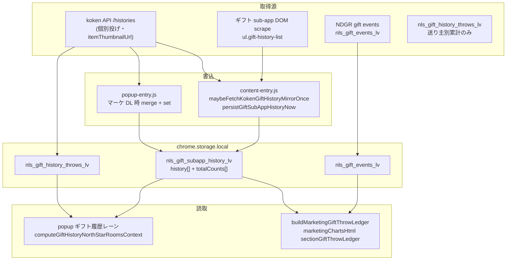

# Codex 会議・実装依頼: ギフト投げ履歴データの正本化とマーケ表示（v0.1.572 以降）

> **データは超重要**。本機能はマーケ判断の根拠になるため、件数・pt・送り主・アイテムの欠落・重複・逆行（減る）は許容しない。

## 起動方法

1. 作業ディレクトリ: `tsuioku-no-kirameki.com`
2. 先に読む: [docs/codex-marketing-analytics-brief.md](codex-marketing-analytics-brief.md) §2 領域ロック
3. 本ファイルを Codex プロンプトに貼る（または `.codex-task-prompt.txt` に要約を入れる）
4. **Claude との会議推奨**: 取得経路（storage 書込）と表示経路の責務切りを合意してから実装

### 最優先（会議結論・v0.1.572）

`npx vitest run src/lib/marketingGiftThrowLedger.test.js` を単体実行すると、`itemAggregates[0].count` が **32 期待に対し 33** で落ちる（`totalCounts` 設定後に `history` 行でも count を加算していた水増し）。**この二重加算修正を他タスクより先に**行い、テストが緑になってからサムネ表示・表示ルール注記へ進むこと。

---

## ユーザーが報告している症状（再現イメージ）

| 症状 | 観測 |
|------|------|
| ギフト履歴が増えない | popup / マーケ HTML の件数が配信中に追随しない。マーケ DL だけ更新される印象 |
| アイテムサムネが出ない | 「アイテム別 pt（グラフ）」は名前＋×回数のみ。チップにはサムネありのケースあり |
| 投げ一覧の欠落・重複 | 上段 NDGR「名称未取得」・ギフト画像なし。下段 koken は完全。同一投げが二重 |
| 公式 UI と数値不一致 | 番組ギフト履歴カード 4280pt vs マーケ 4880pt 等（NDGR 重複の疑い） |

---

## データ経路マップ（正本の候補）



### ストレージキー

| キー | 内容 | マーケ台帳での役割 |
|------|------|-------------------|
| `nls_gift_subapp_history_<lv>` | 個別投げ `history[]` + `totalCounts[]` | **主正本**（koken / DOM マージ） |
| `nls_gift_events_<lv>` | NDGR 時系列 | 補助（公式履歴が無いときのみ台帳に載せる方針 v0.1.571） |
| `nls_gift_history_throws_<lv>` | 送り主別累計 | popup レーン用。**個別投げ一覧には使っていない** |

koken API（実機スキーマ）: `docs` 内 research / `kokenGiftHistoryApi.js` コメント参照  
`GET .../userperspective/contents/gift/live/<lv>/histories` → `data.histories[]` に `id`, `supporterId`, `itemName`, `itemThumbnailUrl`, `point`, `publishedAt`

---

## Claude 側で入った変更（v0.1.567〜0.1.571・要 Codex レビュー）

| 版 | 内容 | ファイル |
|----|------|----------|
| 0.1.567 | マーケ DL で koken fetch + `mergeGiftSubAppHistoryPayload` | popup-entry, kokenGiftHistoryApi |
| 0.1.569 | 送り主別集計・グラフ | marketingGiftThrowLedger, marketingChartsHtml |
| 0.1.570 | サムネ / アカウント / ID 列（送り主） | marketingChartsHtml |
| 0.1.571 | DOM 履歴マージ保存、kokenHistoryId 重複排除、NDGR 台帳省略、マーケ DL 後 storage 書戻し | content-entry, kokenGiftHistoryApi, marketingGiftThrowLedger |

### 未完了・Codex 主担当に残す表示ルール

正本定数（既存）:

```js
// src/lib/marketingGiftThrowLedger.js
export const MARKETING_GIFT_LEDGER_DISPLAY_RULE_NOTE = '...';
```

**ルール（会議で確定させること）**

1. **送り主**: サムネ（usericon）・アカウント名（リンク可）・数値 ID — 他マーケ表と同型
2. **アイテム**: `itemThumbnailUrl` / `thumbnailUrl` が取れていれば **グラフ・表・チップすべて** に表示（現状グラフのみテキスト）
3. **投げ一覧**: アイテム列＝ギフト画像、サムネ列＝送り主（混在禁止）
4. **取得済みフィールドは省略禁止** — 未取得だけ `—` / 空プレースホルダ

### 既知のコードギャップ（Codex 実装候補）

- `itemChart` 生成時に `thumbnailUrl` を渡していない（`marketingGiftThrowLedger.js` L469-475）
- `sectionGiftThrowLedger` が `giftLedgerHorizontalBarChartHtml` をアイテムに使用（サムネ列なし）
- 送り主内訳 `row.items` にアイテムサムネなし
- popup の `renderGiftSubAppHistoryPanel` がサムネ無しテキストリスト

---

## 履歴が「増えない」原因仮説（会議アジェンダ）

### A. 書込がマージでなく置換だった（v0.1.571 で content 側修正済み要検証）

`persistGiftSubAppHistoryNow` が `cache.history = fresh.history` で**部分 DOM スキャン時に古い行が消える**。

修正方針（Claude 実装済み）: `mergeGiftSubAppHistoryPayload` でマージ。

### B. popup 常時同期が無い

koken fetch は **content のタブリーダー 10s 間隔** + **マーケ DL 時のみ popup**。  
popup を開いているだけでは `nls_gift_subapp_history_*` が更新されない可能性。

**会議論点**: popup `refreshAllNorthStarMirrorLanes` 等で koken 同期を入れるか → **Claude 領域**（popup-entry.js）。Codex は「同期後の payload を正しく描画」に専念。

### C. マーケ台帳が NDGR と koken を二重計上していた

v0.1.571: 公式 `giftSubAppHistory` がある配信では NDGR 行を台帳から除外。要 E2E 確認。

### D. koken API のページング

レスポンスに `nextCount` あり。現状 **1 リクエストのみ**。長時間配信で histories が切れる可能性。

**会議論点**: ページング実装の要否（Claude / SW 側）。

### E. `nls_gift_history_throws_*` は累計のみ

個別投げ数と混同しないこと。マーケの `totalThrows` は `buildMarketingGiftThrowLedger` の `allRows.length` が正。

---

## 担当分割（会議で合意）

| 担当 | やること |
|------|----------|
| **Codex** | `marketingGiftThrowLedger.js` 台帳・集計の正しさ（件数/pt/重複）、`marketingChartsHtml.js` 表示ルール完全適用、テスト、マーケ HTML セクション、changelog 文言（marketing 範囲） |
| **Claude** | `content-entry.js` / `popup-entry.js` の storage 同期・koken 定期 fetch・popup 開時 sync、`nextCount` 調査、起動演出誤爆（別チケット v0.1.571 一部済） |
| **共同** | 正本定義（SUB history vs events vs throws）、受け入れテスト手順、実配信 lv での golden 比較 |

Codex は **popup-entry.js / content-entry.js を触らない**（codex-marketing-analytics-brief §2.2）。取得不足は Claude にエスカレーションし、Codex は「渡された payload を欠落なく描画する」契約テストを書く。

---

## Codex 実装タスク（表示・台帳）

### 1. アイテムグラフにサムネ必須

- `giftLedgerItemBarChartHtml(itemAggregates, maskShare)` を新設（送り主グラフ `giftLedgerSenderBarChartHtml` と同型）
- `itemAggregates[].thumbnailUrl` を必ず参照（空ならプレースホルダ）

### 2. 台帳データ

- `itemChart` に `thumbnailUrl` を含める（既に typedef あり）
- 送り主別内訳 `items[]` に `thumbnailUrl` を伝播（sender aggregate で row から拾う — 型は追加済みか要確認）

### 3. セクション注記

- `#mkt-gift-ledger` に `MARKETING_GIFT_LEDGER_DISPLAY_RULE_NOTE` を表示
- `sourceNotes` の内訳（koken 件数 / 省略 NDGR 件数）をわかりやすく

### 4. テスト

- `marketingGiftThrowLedger.test.js`: koken のみ時 NDGR 不出、item 集計 count が totalCounts と整合
- `marketingChartsHtml.test.js`: アイテムグラフに `mkt-gift-ledger-item__thumb` または同等クラス

### 5. 完了条件

```bash
npm run typecheck
npx vitest run src/lib/marketingGiftThrowLedger.test.js src/lib/kokenGiftHistoryApi.test.js src/lib/marketingChartsHtml.test.js
npm run build
```

commit まで（push しない）。ブランチ例: `codex/gift-throw-ledger-data-v0572`

---

## 受け入れテスト（実配信・手動）

1. 拡張 **0.1.572+** を load、対象 lv の watch を開いたまま 2 分以上
2. popup「ギフト sub-app 履歴」の件数が増えることを確認（Claude 同期込み）
3. マーケ HTML 再 DL
4. 確認項目:
   - 投げ一覧が **koken 公式履歴のみ**（NDGR 名称未取得行なし）
   - アイテム別グラフに **ギフトサムネ**
   - 送り主別に **サムネ / アカウント / ID**
   - 件数・合計 pt がニコ生「この番組へのギフト履歴」と同オーダー（完全一致でなくてよいが、NDGR 水増しなし）

---

## 参考ファイル一覧

| ファイル | 役割 |
|----------|------|
| `src/lib/kokenGiftHistoryApi.js` | koken JSON → payload、merge、正規化 |
| `src/lib/marketingGiftThrowLedger.js` | マーケ台帳組み立て |
| `src/lib/marketingChartsHtml.js` | `sectionGiftThrowLedger` |
| `src/extension/popup-entry.js` | マーケ DL・storage 読取（**Codex 非編集**） |
| `src/extension/content-entry.js` | koken mirror・DOM persist（**Codex 非編集**） |
| `docs/research/gift-related-deep-research.md` | 経路棚卸し |

---

## 会議で決めたいこと（チェックリスト）

- [ ] マーケ台帳の正本は `nls_gift_subapp_history_* .history` のみでよいか
- [ ] NDGR を台帳に載せる条件（公式履歴ゼロ時のみでよいか）
- [ ] popup 常時 koken 同期は Claude が実装するか
- [ ] koken `nextCount` ページングの優先度
- [ ] 表示ルールの CSS（グラフ内サムネ 28px 等）の統一
- [ ] バージョン番号（0.1.572 案）と changelog 分担

---

## Claude からのメモ（Cursor セッション）

ユーザーは「データ超重要」のため、**表示の体裁だけ直して件数が嘘**になる変更は禁止。  
先に storage の増分を確認し、次に台帳・HTML を直す順が安全。  
本 brief 承認後、Codex 実装 → Claude が取得経路を足す、の二段がよい。

---

## 調査結果（2026-06-02・v0.1.573 実装）

### なぜ popup が「改善されていない」ように見えたか

| 画面 | v0.1.572 の変更 | 理由 |
|------|-----------------|------|
| マーケ `#mkt-gift-ledger` | 反映済み | Codex 領域 |
| popup 北極星「この番組へのギフト履歴」 | **未反映** | `computeGiftHistoryNorthStarRoomsContext` が `nls_gift_history_throws_*` のみ参照していた |

### 開幕演出（確定原因: B1）

- **最有力**: コメント **軽量 paint → heavy 全件** の二段階で、100 件でプライム後に 2970 件到着 → `noteCommentMilestoneHighWater(100, 2970)` が **1000 件マイルストーン**（`rinku_deluge`）を発火。
- **v0.1.573 修正**: `watchPopupCelebrationGuard` + heavy 完了まで演出遅延 + 件数ジャンプ時再プライム。

### v0.1.573 タスク表（実装済み / 残）

| ID | 担当 | 内容 | 状態 |
|----|------|------|------|
| P0 | Claude | 開幕演出誤爆（popup-entry + watchPopupCelebrationGuard） | **済** v0.1.573 |
| P1 | Claude | popup 開時 koken 同期 `syncKokenGiftHistoryForPopup` | **済** v0.1.573 |
| P2 | Claude | 北極星を `giftSubAppHistory` 優先（`aggregateGiftSubAppHistoryBySender`） | **済** v0.1.573 |
| P3 | Codex | マーケ v0.1.572 実機確認・lib 共通化の要否 | **Codex 会議後** |
| P4 | Claude | koken `nextCount` ページング | 未着手 |

### Codex への引き継ぎ（P3）

- `src/lib/kokenGiftHistoryApi.js` の `aggregateGiftSubAppHistoryBySender` を popup が利用開始。マーケ台帳と数値照合テストを Codex 側で継続可。
- popup / content は引き続き **Codex 非編集**（§2.2）。
