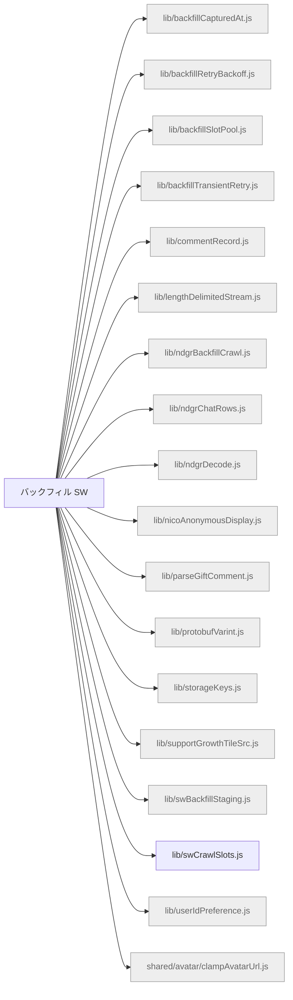

# 機能マップ: バックフィル SW（`backfill-sw`）

> `npm run feature-map` で再生成。手で編集しない。
> 起点 entry: `src/extension/backfill-sw-entry.js`

## storage の出入り

- 書くキー: `KEY_BACKFILL_PROGRESS`, `KEY_SW_PROGRESS`
- 読むキー: (なし)

## 構成ファイル（import 到達・最大40件表示）

