# 機能マップ: コメビュ(別窓)（`comeview`）

> `npm run feature-map` で再生成。手で編集しない。
> 起点 entry: `src/extension/comeview-entry.js`

## storage の出入り

- 書くキー: `KEY_VOICE_DIAG`, `fn:comeviewPinStorageKey`
- 読むキー: `KEY_LAST_WATCH_URL`, `KEY_USER_COMMENT_PROFILE_CACHE`

## 構成ファイル（import 到達・最大40件表示）

```mermaid
graph LR
  n_comeview["コメビュ(別窓)"]
  n_comeview --> n_src_lib_anomalyVerdict_js["lib/anomalyVerdict.js"]:::shared
  n_comeview --> n_src_lib_anonymousIdenticon_js["lib/anonymousIdenticon.js"]:::shared
  n_comeview --> n_src_lib_avatarBroadcasterGuard_js["lib/avatarBroadcasterGuard.js"]:::shared
  n_comeview --> n_src_lib_avatarPartsComposer_js["lib/avatarPartsComposer.js"]:::shared
  n_comeview --> n_src_lib_comeviewActions_js["lib/comeviewActions.js"]:::shared
  n_comeview --> n_src_lib_comeviewInstantRender_js["lib/comeviewInstantRender.js"]
  n_comeview --> n_src_lib_comeviewRows_js["lib/comeviewRows.js"]:::shared
  n_comeview --> n_src_lib_comeviewUserNotes_js["lib/comeviewUserNotes.js"]:::shared
  n_comeview --> n_src_lib_commentChunkStore_js["lib/commentChunkStore.js"]:::shared
  n_comeview --> n_src_lib_commentDb_js["lib/commentDb.js"]:::shared
  n_comeview --> n_src_lib_commentRecord_js["lib/commentRecord.js"]:::shared
  n_comeview --> n_src_lib_commentTailBuffer_js["lib/commentTailBuffer.js"]:::shared
  n_comeview --> n_src_lib_deriveAvatarUrlFromUid_js["lib/deriveAvatarUrlFromUid.js"]:::shared
  n_comeview --> n_src_lib_giftDisplayNickname_js["lib/giftDisplayNickname.js"]:::shared
  n_comeview --> n_src_lib_nicoAnonymousDisplay_js["lib/nicoAnonymousDisplay.js"]:::shared
  n_comeview --> n_src_lib_nicoUserPage_js["lib/nicoUserPage.js"]:::shared
  n_comeview --> n_src_lib_storageKeys_js["lib/storageKeys.js"]:::shared
  n_comeview --> n_src_lib_storageOpTimeout_js["lib/storageOpTimeout.js"]:::shared
  n_comeview --> n_src_lib_supportActivityTimeline_js["lib/supportActivityTimeline.js"]:::shared
  n_comeview --> n_src_lib_supportGridDisplayTier_js["lib/supportGridDisplayTier.js"]:::shared
  n_comeview --> n_src_lib_supportGrowthTileSrc_js["lib/supportGrowthTileSrc.js"]:::shared
  n_comeview --> n_src_lib_supportTimelineHtml_js["lib/supportTimelineHtml.js"]:::shared
  n_comeview --> n_src_lib_userCommentProfileCache_js["lib/userCommentProfileCache.js"]:::shared
  n_comeview --> n_src_lib_userIdPreference_js["lib/userIdPreference.js"]:::shared
  n_comeview --> n_src_lib_voiceAgeGate_js["lib/voiceAgeGate.js"]:::shared
  n_comeview --> n_src_lib_voiceAssignment_js["lib/voiceAssignment.js"]:::shared
  n_comeview --> n_src_lib_voiceDiag_js["lib/voiceDiag.js"]:::shared
  n_comeview --> n_src_lib_voiceDiagKey_js["lib/voiceDiagKey.js"]:::shared
  n_comeview --> n_src_lib_voiceFailureTaxonomy_js["lib/voiceFailureTaxonomy.js"]:::shared
  n_comeview --> n_src_lib_voiceLagBudget_js["lib/voiceLagBudget.js"]:::shared
  n_comeview --> n_src_lib_voiceLoadingState_js["lib/voiceLoadingState.js"]:::shared
  n_comeview --> n_src_lib_voicePlayer_js["lib/voicePlayer.js"]:::shared
  n_comeview --> n_src_lib_voiceReadQueue_js["lib/voiceReadQueue.js"]:::shared
  n_comeview --> n_src_lib_voiceSynthFailure_js["lib/voiceSynthFailure.js"]:::shared
  n_comeview --> n_src_lib_voiceSynthFailureReason_js["lib/voiceSynthFailureReason.js"]:::shared
  n_comeview --> n_src_lib_voicevoxClient_js["lib/voicevoxClient.js"]:::shared
  n_comeview --> n_src_shared_avatar_avatarUrlGuard_js["shared/avatar/avatarUrlGuard.js"]:::shared
  n_comeview --> n_src_shared_avatar_clampAvatarUrl_js["shared/avatar/clampAvatarUrl.js"]:::shared
  classDef shared fill:#eee,stroke:#999,color:#666;
```

