# 機能マップ: 記録エンジン(watchページ常駐)（`content`）

> `npm run feature-map` で再生成。手で編集しない。
> 起点 entry: `src/extension/content-entry.js`

## storage の出入り

- 書くキー: `KEY_AI_SHARE_FAST_DIAG`, `KEY_AUTO_BACKUP_STATE`, `KEY_BACKFILL_HEARTBEAT_INDEX`, `KEY_BACKFILL_LIVE_METRIC`, `KEY_BACKFILL_PROGRESS`, `KEY_BGM_PHASE_DIAG`, `KEY_COMMENT_INGEST_LOG`, `KEY_COMMENT_PANEL_STATUS`, `KEY_COMMENT_TIMELINE_MIRROR`, `KEY_CONCURRENT_CALIBRATION_RING_V1`, `KEY_DIAGNOSTICS_ERROR_RING_V1`, `KEY_GIFT_EFFECT_DIAG`, `KEY_HIGHLIGHT_LEDGER`, `KEY_INLINE_PANEL_PLACEMENT`, `KEY_INLINE_PANEL_VIEWPORT_WIDE_ONCE_DONE`, `KEY_LIVE_BROADCASTER_CTX`, `KEY_RECORDING_WATCHDOG`, `KEY_SELF_POSTED_RECENTS`, `KEY_STATUS_FAST_DIAG_LITE`, `KEY_STORAGE_WRITE_ERROR`, `KEY_USER_COMMENT_PROFILE_CACHE`, `KEY_VENUE_EFFECT_SOUND_PRESENCE`, `KEY_VENUE_SEATS_DIAG`, `KEY_VOICE_DIAG`, `KEY_VOICE_EFFECT_DIAG`, `fn:backfillHeartbeatKey`, `fn:chunkIndexKey`, `fn:chunkMigratedKey`, `fn:eventDomStorageKey`, `fn:giftSubAppHistoryStorageKey`, `fn:officialGiftPointsAggregateStorageKey`, `fn:tailStorageKey`
- 読むキー: `KEY_AUTO_BACKUP_STATE`, `KEY_BACKFILL_AUTO_DISABLED`, `KEY_BACKFILL_BG_KICK_ENABLED`, `KEY_BACKFILL_ENABLED`, `KEY_BACKFILL_HEARTBEAT_INDEX`, `KEY_BACKFILL_SW_MODE`, `KEY_BGM_ENABLED`, `KEY_BGM_VOLUME_FEVER`, `KEY_BGM_VOLUME_REACH`, `KEY_CDB_OFFSCREEN_ENABLED`, `KEY_COMMENTER_FOLLOWING_LIST_CACHE`, `KEY_COMMENTER_FOLLOW_CACHE`, `KEY_COMMENT_IDB_ENABLED`, `KEY_COMMENT_INGEST_LOG`, `KEY_COMMENT_PANEL_AUTO_RESTORE`, `KEY_CONCURRENT_CALIBRATION_RING_V1`, `KEY_DEEP_HARVEST_QUIET_UI`, `KEY_DIAGNOSTICS_ERROR_RING_V1`, `KEY_EFFECT_SOUND_ENABLED`, `KEY_GIFT_RANKING_LANE_ENABLED`, `KEY_HIGHLIGHT_LEDGER`, `KEY_INCREMENTAL_DEDUP_ENABLED`, `KEY_INLINE_FLOATING_ANCHOR`, `KEY_INLINE_PANEL_AUTOSHOW_ENABLED`, `KEY_INLINE_PANEL_PLACEMENT`, `KEY_INLINE_PANEL_PLACEMENT_USER_EXPLICIT`, `KEY_INLINE_PANEL_VIEWPORT_WIDE_ONCE_DONE`, `KEY_INLINE_PANEL_VIEWPORT_WIDE_POLICY`, `KEY_INLINE_PANEL_WIDTH_MODE`, `KEY_LANE_MIRROR`, `KEY_LIVE_BROADCASTER_CTX`, `KEY_NDGR_DETERMINISTIC_BACKFILL`, `KEY_NDGR_FORWARD_ENABLED`, `KEY_POPUP_FRAME`, `KEY_POPUP_FRAME_CUSTOM`, `KEY_PROFILE_RESOLVE_STATE`, `KEY_RECORDING`, `KEY_SELF_POSTED_RECENTS`, `KEY_STORY_DIAG_MIRROR`, `KEY_THUMB_AUTO`, `KEY_THUMB_INTERVAL_MS`, `KEY_USER_COMMENT_PROFILE_CACHE`

## 構成ファイル（import 到達・最大40件表示）

```mermaid
graph LR
  n_content["記録エンジン(watchページ常駐)"]
  n_content --> n_src_domain_lane_columns_kontaPolicy_js["domain/lane/columns/kontaPolicy.js"]:::shared
  n_content --> n_src_domain_lane_columns_linkPolicy_js["domain/lane/columns/linkPolicy.js"]:::shared
  n_content --> n_src_domain_lane_columns_tanuPolicy_js["domain/lane/columns/tanuPolicy.js"]:::shared
  n_content --> n_src_domain_lane_tier_js["domain/lane/tier.js"]:::shared
  n_content --> n_src_domain_user_identity_js["domain/user/identity.js"]:::shared
  n_content --> n_src_domain_user_nickname_js["domain/user/nickname.js"]:::shared
  n_content --> n_src_extension_story_renderStoryUserLaneDom_js["extension/story/renderStoryUserLaneDom.js"]:::shared
  n_content --> n_src_extension_venueBar_js["extension/venueBar.js"]:::shared
  n_content --> n_src_lib_anonymousIdenticon_js["lib/anonymousIdenticon.js"]:::shared
  n_content --> n_src_lib_arrivalEffect_js["lib/arrivalEffect.js"]:::shared
  n_content --> n_src_lib_auditionEventRankingApi_js["lib/auditionEventRankingApi.js"]:::shared
  n_content --> n_src_lib_autoBackupState_js["lib/autoBackupState.js"]
  n_content --> n_src_lib_avatarBroadcasterGuard_js["lib/avatarBroadcasterGuard.js"]:::shared
  n_content --> n_src_lib_avatarUrlCompare_js["lib/avatarUrlCompare.js"]:::shared
  n_content --> n_src_lib_backfillCapturedAt_js["lib/backfillCapturedAt.js"]:::shared
  n_content --> n_src_lib_backfillFlushThreshold_js["lib/backfillFlushThreshold.js"]
  n_content --> n_src_lib_backfillHeartbeat_js["lib/backfillHeartbeat.js"]
  n_content --> n_src_lib_backfillOptIn_js["lib/backfillOptIn.js"]:::shared
  n_content --> n_src_lib_backfillRemoveRecommendedLivePollution_js["lib/backfillRemoveRecommendedLivePollution.js"]:::shared
  n_content --> n_src_lib_backfillRetryBackoff_js["lib/backfillRetryBackoff.js"]:::shared
  n_content --> n_src_lib_backfillRotationGate_js["lib/backfillRotationGate.js"]
  n_content --> n_src_lib_backfillSlotAutoThrottle_js["lib/backfillSlotAutoThrottle.js"]
  n_content --> n_src_lib_backfillSlotPool_js["lib/backfillSlotPool.js"]:::shared
  n_content --> n_src_lib_backfillTransientRetry_js["lib/backfillTransientRetry.js"]:::shared
  n_content --> n_src_lib_backfillVisibilityRearm_js["lib/backfillVisibilityRearm.js"]
  n_content --> n_src_lib_bgmDirector_js["lib/bgmDirector.js"]:::shared
  n_content --> n_src_lib_bgmPhaseDiag_js["lib/bgmPhaseDiag.js"]:::shared
  n_content --> n_src_lib_bgmPhaseDiagKey_js["lib/bgmPhaseDiagKey.js"]:::shared
  n_content --> n_src_lib_broadcastContext_js["lib/broadcastContext.js"]:::shared
  n_content --> n_src_lib_broadcastUrl_js["lib/broadcastUrl.js"]:::shared
  n_content --> n_src_lib_broadcasterProfileCard_js["lib/broadcasterProfileCard.js"]:::shared
  n_content --> n_src_lib_broadcasterUserId_js["lib/broadcasterUserId.js"]
  n_content --> n_src_lib_captureAuditionRichviewEventScoreDiagProbe_js["lib/captureAuditionRichviewEventScoreDiagProbe.js"]
  n_content --> n_src_lib_celebrationCharaAssets_js["lib/celebrationCharaAssets.js"]:::shared
  n_content --> n_src_lib_celebrationFlyText_js["lib/celebrationFlyText.js"]:::shared
  n_content --> n_src_lib_celebrationPika_js["lib/celebrationPika.js"]:::shared
  n_content --> n_src_lib_channelBroadcasterMeta_js["lib/channelBroadcasterMeta.js"]
  n_content --> n_src_lib_channelSwitchDiag_js["lib/channelSwitchDiag.js"]:::shared
  n_content --> n_src_lib_channelSwitchDiagKey_js["lib/channelSwitchDiagKey.js"]:::shared
  n_content --> n_src_lib_cleanNdgrChatRows_js["lib/cleanNdgrChatRows.js"]
  classDef shared fill:#eee,stroke:#999,color:#666;
```

> ほか 269 ファイル省略（全件は storage-bus.md / metafile 参照）。
