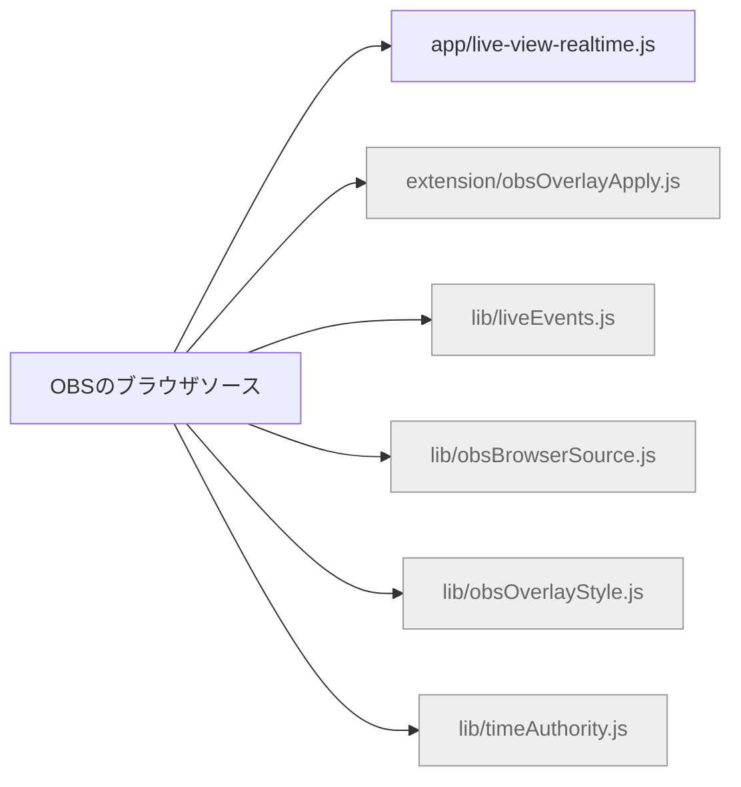

# 機能マップ: OBSのブラウザソース（`obs-browser`）

> `npm run feature-map` で再生成。手で編集しない。
> 起点 entry: `app/obs-overlay.js`

## storage の出入り

- 書くキー: (なし)
- 読むキー: (なし)

## 構成ファイル（import 到達・最大40件表示）

```mermaid
graph LR
  n_obs_browser["OBSのブラウザソース"]
  n_obs_browser --> n_app_live_view_realtime_js["app/live-view-realtime.js"]
  n_obs_browser --> n_src_extension_obsOverlayApply_js["extension/obsOverlayApply.js"]:::shared
  n_obs_browser --> n_src_lib_liveEvents_js["lib/liveEvents.js"]:::shared
  n_obs_browser --> n_src_lib_obsBrowserSource_js["lib/obsBrowserSource.js"]:::shared
  n_obs_browser --> n_src_lib_obsOverlayStyle_js["lib/obsOverlayStyle.js"]:::shared
  n_obs_browser --> n_src_lib_timeAuthority_js["lib/timeAuthority.js"]:::shared
  classDef shared fill:#eee,stroke:#999,color:#666;
```
