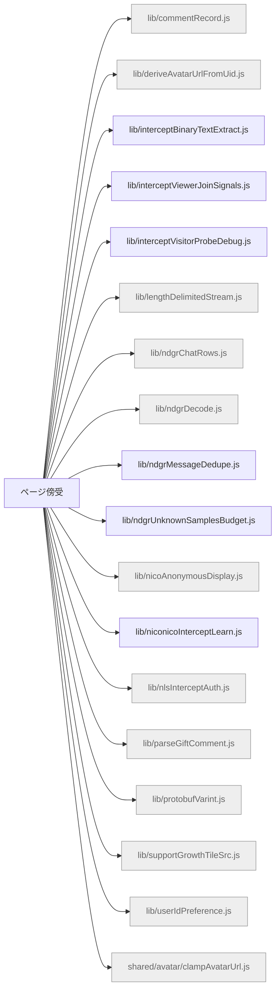

# 機能マップ: ページ傍受（`page-intercept`）

> `npm run feature-map` で再生成。手で編集しない。
> 起点 entry: `src/extension/page-intercept-entry.js`

## storage の出入り

- 書くキー: (なし)
- 読むキー: (なし)

## 構成ファイル（import 到達・最大40件表示）

