# 機能マップ: ポップアップ(応援レーン)（`popup`）

> `npm run feature-map` で再生成。手で編集しない。
> 起点 entry: `src/extension/popup-entry.js`

## storage の出入り

- 書くキー: `KEY_BACKFILL_ENABLED`, `KEY_BACKFILL_PROGRESS`, `KEY_CHEER_RECENT_V1`, `KEY_COMMENTER_FOLLOW_CACHE`, `KEY_COMMENT_INGEST_LOG`, `KEY_CONCURRENT_CALIBRATION_RING_V1`, `KEY_GIFT_RANKING_LANE_ENABLED`, `KEY_PAINT_PERF_RING_V1`, `KEY_POPUP_FRAME`, `KEY_POPUP_FRAME_CUSTOM`, `KEY_STORAGE_WRITE_ERROR`, `KEY_VOICE_INPUT_DEVICE`, `fn:perfDiagStorageKey`
- 読むキー: `KEY_AI_SHARE_FAST_DIAG`, `KEY_ANONYMOUS_IDENTICON_ENABLED`, `KEY_AUTOPATROL_ENABLED`, `KEY_AUTOPATROL_STATE`, `KEY_BACKFILL_AUTO_DISABLED`, `KEY_BACKFILL_PROGRESS`, `KEY_CALM_PANEL_MOTION`, `KEY_CHEER_RECENT_V1`, `KEY_COMMENTER_FOLLOW_CACHE`, `KEY_COMMENT_INGEST_LOG`, `KEY_COMMENT_PANEL_STATUS`, `KEY_CONCURRENT_CALIBRATION_RING_V1`, `KEY_DEEP_HARVEST_QUIET_UI`, `KEY_FOLD_ANONYMOUS_IN_RANK_STRIP`, `KEY_GIFT_RANKING_LANE_ENABLED`, `KEY_INLINE_FLOATING_ANCHOR`, `KEY_INLINE_PANEL_AUTOSHOW_ENABLED`, `KEY_INLINE_PANEL_PLACEMENT`, `KEY_INLINE_PANEL_PLACEMENT_USER_EXPLICIT`, `KEY_INLINE_PANEL_VIEWPORT_WIDE_ONCE_DONE`, `KEY_INLINE_PANEL_VIEWPORT_WIDE_POLICY`, `KEY_INLINE_PANEL_WIDTH_MODE`, `KEY_LAST_WATCH_URL`, `KEY_MARKETING_EXPORT_MASK_LABELS`, `KEY_POPUP_FRAME`, `KEY_POPUP_FRAME_CUSTOM`, `KEY_RECORDING`, `KEY_RECORDING_WATCHDOG`, `KEY_SELF_POSTED_RECENTS`, `KEY_STORAGE_WRITE_ERROR`, `KEY_STORY_GROWTH_COLLAPSED`, `KEY_SUPPORT_CELEBRATION_STATE`, `KEY_THUMB_AUTO`, `KEY_THUMB_INTERVAL_MS`, `KEY_USER_COMMENT_PROFILE_CACHE`, `KEY_VOICE_INPUT_DEVICE`, `fn:chunkIndexKey`, `fn:commentDbSummaryKey`, `fn:watchSnapshotStorageKey`, `nls_mcp_live_latest_v1`

## 構成ファイル（import 到達・最大40件表示）

```mermaid
graph LR
  n_popup["ポップアップ(応援レーン)"]
  n_popup --> n_src_data_acquirers_laneFromStorage_js["data/acquirers/laneFromStorage.js"]
  n_popup --> n_src_data_sources_laneFromStoredComments_js["data/sources/laneFromStoredComments.js"]
  n_popup --> n_src_data_store_laneStore_js["data/store/laneStore.js"]
  n_popup --> n_src_domain_lane_aggregate_js["domain/lane/aggregate.js"]
  n_popup --> n_src_domain_lane_columns_kontaPolicy_js["domain/lane/columns/kontaPolicy.js"]
  n_popup --> n_src_domain_lane_columns_linkPolicy_js["domain/lane/columns/linkPolicy.js"]
  n_popup --> n_src_domain_lane_columns_tanuPolicy_js["domain/lane/columns/tanuPolicy.js"]
  n_popup --> n_src_domain_lane_tier_js["domain/lane/tier.js"]
  n_popup --> n_src_domain_user_avatar_js["domain/user/avatar.js"]
  n_popup --> n_src_domain_user_identity_js["domain/user/identity.js"]:::shared
  n_popup --> n_src_domain_user_nickname_js["domain/user/nickname.js"]
  n_popup --> n_src_extension_story_renderStoryUserLaneDom_js["extension/story/renderStoryUserLaneDom.js"]
  n_popup --> n_src_lib_acquisitionDashboardChart_js["lib/acquisitionDashboardChart.js"]
  n_popup --> n_src_lib_aiShareDiagSchema_js["lib/aiShareDiagSchema.js"]
  n_popup --> n_src_lib_aiShareFastDiagKey_js["lib/aiShareFastDiagKey.js"]:::shared
  n_popup --> n_src_lib_aiSharePopupDiagKey_js["lib/aiSharePopupDiagKey.js"]:::shared
  n_popup --> n_src_lib_anonymousIdenticon_js["lib/anonymousIdenticon.js"]:::shared
  n_popup --> n_src_lib_audienceEngagementGap_js["lib/audienceEngagementGap.js"]
  n_popup --> n_src_lib_auditionEventRankingApi_js["lib/auditionEventRankingApi.js"]:::shared
  n_popup --> n_src_lib_avatarBroadcasterGuard_js["lib/avatarBroadcasterGuard.js"]:::shared
  n_popup --> n_src_lib_avatarPartsComposer_js["lib/avatarPartsComposer.js"]:::shared
  n_popup --> n_src_lib_avatarUrlCompare_js["lib/avatarUrlCompare.js"]:::shared
  n_popup --> n_src_lib_backfillOptIn_js["lib/backfillOptIn.js"]:::shared
  n_popup --> n_src_lib_backfillRemoveGiftSystemMessages_js["lib/backfillRemoveGiftSystemMessages.js"]
  n_popup --> n_src_lib_backfillRemoveRecommendedLivePollution_js["lib/backfillRemoveRecommendedLivePollution.js"]:::shared
  n_popup --> n_src_lib_backfillRinkuNarration_js["lib/backfillRinkuNarration.js"]
  n_popup --> n_src_lib_blobDownload_js["lib/blobDownload.js"]
  n_popup --> n_src_lib_broadcastCrossCompare_js["lib/broadcastCrossCompare.js"]
  n_popup --> n_src_lib_broadcastDurationLabel_js["lib/broadcastDurationLabel.js"]
  n_popup --> n_src_lib_broadcastNarrativeBuilder_js["lib/broadcastNarrativeBuilder.js"]
  n_popup --> n_src_lib_broadcastReportSummary_js["lib/broadcastReportSummary.js"]
  n_popup --> n_src_lib_broadcastSessionSummaryDb_js["lib/broadcastSessionSummaryDb.js"]
  n_popup --> n_src_lib_broadcastSessionSummaryFlush_js["lib/broadcastSessionSummaryFlush.js"]
  n_popup --> n_src_lib_broadcastUrl_js["lib/broadcastUrl.js"]:::shared
  n_popup --> n_src_lib_broadcastWaveformFingerprint_js["lib/broadcastWaveformFingerprint.js"]
  n_popup --> n_src_lib_broadcasterCommentCount_js["lib/broadcasterCommentCount.js"]
  n_popup --> n_src_lib_broadcasterFollowTarget_js["lib/broadcasterFollowTarget.js"]
  n_popup --> n_src_lib_broadcasterProfileCard_js["lib/broadcasterProfileCard.js"]:::shared
  n_popup --> n_src_lib_buildNorthStarAdRankingStatsHtml_js["lib/buildNorthStarAdRankingStatsHtml.js"]
  n_popup --> n_src_lib_buildWatchMetaCardAudienceViewModel_js["lib/buildWatchMetaCardAudienceViewModel.js"]
  classDef shared fill:#eee,stroke:#999,color:#666;
```

> ほか 243 ファイル省略（全件は storage-bus.md / metafile 参照）。
