# 機能マップ: ポップアップ(応援レーン)（`popup`）

> `npm run feature-map` で再生成。手で編集しない。
> 起点 entry: `src/extension/popup-entry.js`

## storage の出入り

- 書くキー: `KEY_BACKFILL_ENABLED`, `KEY_BACKFILL_PROGRESS`, `KEY_BGM_PHASE_DIAG`, `KEY_CHEER_RECENT_V1`, `KEY_COMMENTER_FOLLOW_CACHE`, `KEY_COMMENT_INGEST_LOG`, `KEY_COMMENT_POST_DIAG`, `KEY_CONCURRENT_CALIBRATION_RING_V1`, `KEY_GIFT_RANKING_LANE_ENABLED`, `KEY_HIGHLIGHT_LEDGER`, `KEY_LANE_DIAG`, `KEY_MILESTONE_EFFECT_DIAG`, `KEY_OP_SOUND_EFFECT_DIAG`, `KEY_PAINT_PERF_RING_V1`, `KEY_PANEL_WAKE_CURTAIN_DIAG`, `KEY_POPUP_FRAME`, `KEY_POPUP_FRAME_CUSTOM`, `KEY_PREVIEW_RENDER_ACK`, `KEY_REPORT_PREVIEW`, `KEY_SCORE_ANNOUNCE_DIAG`, `KEY_STORAGE_WRITE_ERROR`, `KEY_VOICE_EFFECT_DIAG`, `KEY_VOICE_INPUT_DEVICE`, `fn:perfDiagStorageKey`
- 読むキー: `KEY_AI_SHARE_FAST_DIAG`, `KEY_ANONYMOUS_IDENTICON_ENABLED`, `KEY_AUTOPATROL_ENABLED`, `KEY_AUTOPATROL_STATE`, `KEY_BACKFILL_AUTO_DISABLED`, `KEY_BACKFILL_PROGRESS`, `KEY_BGM_ENABLED`, `KEY_BGM_VOLUME_FEVER`, `KEY_BGM_VOLUME_REACH`, `KEY_CALM_PANEL_MOTION`, `KEY_CHEER_RECENT_V1`, `KEY_COMMENTER_FOLLOW_CACHE`, `KEY_COMMENT_INGEST_LOG`, `KEY_COMMENT_PANEL_STATUS`, `KEY_COMMENT_TIMELINE_MIRROR`, `KEY_CONCURRENT_CALIBRATION_RING_V1`, `KEY_DEEP_HARVEST_QUIET_UI`, `KEY_FOLD_ANONYMOUS_IN_RANK_STRIP`, `KEY_GIFT_EFFECT_DIAG`, `KEY_GIFT_RANKING_LANE_ENABLED`, `KEY_HIGHLIGHT_LEDGER`, `KEY_INLINE_FLOATING_ANCHOR`, `KEY_INLINE_PANEL_AUTOSHOW_ENABLED`, `KEY_INLINE_PANEL_PLACEMENT`, `KEY_INLINE_PANEL_PLACEMENT_USER_EXPLICIT`, `KEY_INLINE_PANEL_VIEWPORT_WIDE_ONCE_DONE`, `KEY_INLINE_PANEL_VIEWPORT_WIDE_POLICY`, `KEY_INLINE_PANEL_WIDTH_MODE`, `KEY_LANE_MIRROR`, `KEY_LAST_WATCH_URL`, `KEY_MARKETING_EXPORT_MASK_LABELS`, `KEY_NORTH_STAR_MIRROR`, `KEY_OP_SOUND_ENABLED`, `KEY_POPUP_FRAME`, `KEY_POPUP_FRAME_CUSTOM`, `KEY_PREVIEW_RENDER_ACK`, `KEY_RECORDING`, `KEY_RECORDING_WATCHDOG`, `KEY_REPORT_PREVIEW`, `KEY_SELF_POSTED_RECENTS`, `KEY_STAT_CARDS_MIRROR`, `KEY_STORAGE_WRITE_ERROR`, `KEY_STORY_GROWTH_COLLAPSED`, `KEY_SUPPORT_CELEBRATION_STATE`, `KEY_THUMB_AUTO`, `KEY_THUMB_INTERVAL_MS`, `KEY_TOP_SUPPORTERS_MIRROR`, `KEY_USER_COMMENT_PROFILE_CACHE`, `KEY_VENUE_BUTTON_VISIBLE`, `KEY_VENUE_EFFECT_SOUND_PRESENCE`, `KEY_VOICE_DIAG`, `KEY_VOICE_INPUT_DEVICE`, `fn:chunkIndexKey`, `fn:commentDbSummaryKey`, `fn:summaryStorageKey`, `fn:tailStorageKey`, `fn:watchSnapshotStorageKey`, `nls_mcp_live_latest_v1`

## 構成ファイル（import 到達・最大40件表示）

```mermaid
graph LR
  n_popup["ポップアップ(応援レーン)"]
  n_popup --> n_src_data_acquirers_laneFromStorage_js["data/acquirers/laneFromStorage.js"]
  n_popup --> n_src_data_sources_laneFromStoredComments_js["data/sources/laneFromStoredComments.js"]
  n_popup --> n_src_data_store_laneStore_js["data/store/laneStore.js"]
  n_popup --> n_src_domain_lane_aggregate_js["domain/lane/aggregate.js"]
  n_popup --> n_src_domain_lane_columns_kontaPolicy_js["domain/lane/columns/kontaPolicy.js"]:::shared
  n_popup --> n_src_domain_lane_columns_linkPolicy_js["domain/lane/columns/linkPolicy.js"]:::shared
  n_popup --> n_src_domain_lane_columns_tanuPolicy_js["domain/lane/columns/tanuPolicy.js"]:::shared
  n_popup --> n_src_domain_lane_evidence_js["domain/lane/evidence.js"]
  n_popup --> n_src_domain_lane_tier_js["domain/lane/tier.js"]:::shared
  n_popup --> n_src_domain_user_avatar_js["domain/user/avatar.js"]
  n_popup --> n_src_domain_user_identity_js["domain/user/identity.js"]:::shared
  n_popup --> n_src_domain_user_nickname_js["domain/user/nickname.js"]:::shared
  n_popup --> n_src_extension_popup_attachAiDiagButtonHandler_js["extension/popup/attachAiDiagButtonHandler.js"]
  n_popup --> n_src_extension_popup_renderAcquisitionDashboard_js["extension/popup/renderAcquisitionDashboard.js"]
  n_popup --> n_src_extension_popup_report_htmlReportDocument_js["extension/popup/report/htmlReportDocument.js"]
  n_popup --> n_src_extension_story_laneContentLod_js["extension/story/laneContentLod.js"]:::shared
  n_popup --> n_src_extension_story_renderStoryUserLaneDom_js["extension/story/renderStoryUserLaneDom.js"]:::shared
  n_popup --> n_src_lib_acquisitionDashboardChart_js["lib/acquisitionDashboardChart.js"]
  n_popup --> n_src_lib_adLanePicksFromRooms_js["lib/adLanePicksFromRooms.js"]
  n_popup --> n_src_lib_adMessageLines_js["lib/adMessageLines.js"]:::shared
  n_popup --> n_src_lib_aiShareDiagSchema_js["lib/aiShareDiagSchema.js"]
  n_popup --> n_src_lib_aiShareFastDiagKey_js["lib/aiShareFastDiagKey.js"]
  n_popup --> n_src_lib_aiSharePopupDiagKey_js["lib/aiSharePopupDiagKey.js"]:::shared
  n_popup --> n_src_lib_anomalyVerdict_js["lib/anomalyVerdict.js"]:::shared
  n_popup --> n_src_lib_anonymousIdenticon_js["lib/anonymousIdenticon.js"]:::shared
  n_popup --> n_src_lib_audienceEngagementGap_js["lib/audienceEngagementGap.js"]
  n_popup --> n_src_lib_auditionEventRankingApi_js["lib/auditionEventRankingApi.js"]:::shared
  n_popup --> n_src_lib_avatarBroadcasterGuard_js["lib/avatarBroadcasterGuard.js"]:::shared
  n_popup --> n_src_lib_avatarEntryCounts_js["lib/avatarEntryCounts.js"]
  n_popup --> n_src_lib_avatarPartsComposer_js["lib/avatarPartsComposer.js"]:::shared
  n_popup --> n_src_lib_avatarRetrySweepThrottle_js["lib/avatarRetrySweepThrottle.js"]
  n_popup --> n_src_lib_avatarUrlCompare_js["lib/avatarUrlCompare.js"]:::shared
  n_popup --> n_src_lib_backfillOptIn_js["lib/backfillOptIn.js"]:::shared
  n_popup --> n_src_lib_backfillRemoveGiftSystemMessages_js["lib/backfillRemoveGiftSystemMessages.js"]
  n_popup --> n_src_lib_backfillRemoveRecommendedLivePollution_js["lib/backfillRemoveRecommendedLivePollution.js"]:::shared
  n_popup --> n_src_lib_backfillRinkuNarration_js["lib/backfillRinkuNarration.js"]:::shared
  n_popup --> n_src_lib_bandScale_js["lib/bandScale.js"]
  n_popup --> n_src_lib_bandScaleBoot_js["lib/bandScaleBoot.js"]
  n_popup --> n_src_lib_bgmDirector_js["lib/bgmDirector.js"]:::shared
  n_popup --> n_src_lib_bgmPhaseDiag_js["lib/bgmPhaseDiag.js"]:::shared
  classDef shared fill:#eee,stroke:#999,color:#666;
```

> ほか 398 ファイル省略（全件は storage-bus.md / metafile 参照）。
