# 機能マップ: 状態速報ページ（`status`）

> `npm run feature-map` で再生成。手で編集しない。
> 起点 entry: `src/extension/status-entry.js`

## storage の出入り

- 書くキー: `KEY_BGM_ENABLED`, `KEY_BGM_VOLUME_FEVER`, `KEY_BGM_VOLUME_REACH`, `KEY_LIVEVIEW_PUBLISH_PAYLOAD`, `KEY_STATUS_TREND`, `KEY_STATUS_UPLOAD_CONFIG`, `KEY_WEB_PUBLISH_OPT_IN`
- 読むキー: `KEY_AI_SHARE_POPUP_DIAG`, `KEY_BACKFILL_LIVE_METRIC`, `KEY_BGM_ENABLED`, `KEY_BGM_PHASE_DIAG`, `KEY_BGM_VOLUME_FEVER`, `KEY_BGM_VOLUME_REACH`, `KEY_COMMENT_POST_DIAG`, `KEY_COMMENT_TIMELINE_MIRROR`, `KEY_CUSTOM_SOUND_REV`, `KEY_GIFT_EFFECT_DIAG`, `KEY_LANE_DIAG`, `KEY_LANE_MIRROR`, `KEY_LAST_WATCH_URL`, `KEY_LIVEVIEW_PUBLISH_OUTCOME`, `KEY_MILESTONE_EFFECT_DIAG`, `KEY_NORTH_STAR_MIRROR`, `KEY_OP_SOUND_EFFECT_DIAG`, `KEY_REPORT_PREVIEW`, `KEY_STATUS_FAST_DIAG_LITE`, `KEY_STATUS_TREND`, `KEY_STATUS_UPLOAD_CONFIG`, `KEY_STAT_CARDS_MIRROR`, `KEY_VENUE_SEATS_DIAG`, `KEY_VOICE_DIAG`, `KEY_VOICE_EFFECT_DIAG`, `KEY_WEB_PUBLISH_OPT_IN`, `nls_backfill_progress_v1`

## 構成ファイル（import 到達・最大40件表示）

```mermaid
graph LR
  n_status["状態速報ページ"]
  n_status --> n_src_domain_user_identity_js["domain/user/identity.js"]:::shared
  n_status --> n_src_lib_aiShareFullText_js["lib/aiShareFullText.js"]
  n_status --> n_src_lib_aiSharePopupDiagKey_js["lib/aiSharePopupDiagKey.js"]:::shared
  n_status --> n_src_lib_anomalyVerdict_js["lib/anomalyVerdict.js"]:::shared
  n_status --> n_src_lib_anonymousIdenticon_js["lib/anonymousIdenticon.js"]:::shared
  n_status --> n_src_lib_autoPublishDecision_js["lib/autoPublishDecision.js"]
  n_status --> n_src_lib_avatarLoadReport_js["lib/avatarLoadReport.js"]
  n_status --> n_src_lib_avatarPartsComposer_js["lib/avatarPartsComposer.js"]:::shared
  n_status --> n_src_lib_backfillRemoveRecommendedLivePollution_js["lib/backfillRemoveRecommendedLivePollution.js"]:::shared
  n_status --> n_src_lib_backfillRinkuNarration_js["lib/backfillRinkuNarration.js"]:::shared
  n_status --> n_src_lib_backgroundWatchTab_js["lib/backgroundWatchTab.js"]
  n_status --> n_src_lib_bgmPhaseDiag_js["lib/bgmPhaseDiag.js"]:::shared
  n_status --> n_src_lib_bgmPhaseDiagKey_js["lib/bgmPhaseDiagKey.js"]:::shared
  n_status --> n_src_lib_broadcastScore_js["lib/broadcastScore.js"]:::shared
  n_status --> n_src_lib_broadcastScorePanelViewModel_js["lib/broadcastScorePanelViewModel.js"]:::shared
  n_status --> n_src_lib_broadcasterReputationKeywords_js["lib/broadcasterReputationKeywords.js"]
  n_status --> n_src_lib_broadcasterReputationView_js["lib/broadcasterReputationView.js"]
  n_status --> n_src_lib_channelSwitchDiag_js["lib/channelSwitchDiag.js"]:::shared
  n_status --> n_src_lib_channelSwitchDiagKey_js["lib/channelSwitchDiagKey.js"]:::shared
  n_status --> n_src_lib_chikuranCard_js["lib/chikuranCard.js"]
  n_status --> n_src_lib_chikuranHeaderDom_js["lib/chikuranHeaderDom.js"]
  n_status --> n_src_lib_commentCountProvenance_js["lib/commentCountProvenance.js"]
  n_status --> n_src_lib_commentPostDiag_js["lib/commentPostDiag.js"]:::shared
  n_status --> n_src_lib_commentPostDiagKey_js["lib/commentPostDiagKey.js"]:::shared
  n_status --> n_src_lib_commentSummary_js["lib/commentSummary.js"]:::shared
  n_status --> n_src_lib_commentTimelineMirror_js["lib/commentTimelineMirror.js"]:::shared
  n_status --> n_src_lib_commentTimelineMirrorKey_js["lib/commentTimelineMirrorKey.js"]:::shared
  n_status --> n_src_lib_commentTimelineReport_js["lib/commentTimelineReport.js"]
  n_status --> n_src_lib_completenessScore_js["lib/completenessScore.js"]
  n_status --> n_src_lib_copyTextWithFallback_js["lib/copyTextWithFallback.js"]
  n_status --> n_src_lib_customSoundDiag_js["lib/customSoundDiag.js"]
  n_status --> n_src_lib_customSoundPreset_js["lib/customSoundPreset.js"]
  n_status --> n_src_lib_customSoundStore_js["lib/customSoundStore.js"]:::shared
  n_status --> n_src_lib_deriveAvatarUrlFromUid_js["lib/deriveAvatarUrlFromUid.js"]:::shared
  n_status --> n_src_lib_diagnosisRegistry_js["lib/diagnosisRegistry.js"]
  n_status --> n_src_lib_diagnosticsTrust_js["lib/diagnosticsTrust.js"]
  n_status --> n_src_lib_effectSoundPlayer_js["lib/effectSoundPlayer.js"]:::shared
  n_status --> n_src_lib_giftDisplayNickname_js["lib/giftDisplayNickname.js"]:::shared
  n_status --> n_src_lib_giftEffectDiag_js["lib/giftEffectDiag.js"]:::shared
  n_status --> n_src_lib_giftEffectDiagKey_js["lib/giftEffectDiagKey.js"]:::shared
  classDef shared fill:#eee,stroke:#999,color:#666;
```

> ほか 94 ファイル省略（全件は storage-bus.md / metafile 参照）。
