# 機能マップ: 状態速報ページ（`status`）

> `npm run feature-map` で再生成。手で編集しない。
> 起点 entry: `src/extension/status-entry.js`

## storage の出入り

- 書くキー: `KEY_STATUS_TREND`
- 読むキー: `KEY_AI_SHARE_POPUP_DIAG`, `KEY_LANE_DIAG`, `KEY_LANE_MIRROR`, `KEY_LAST_WATCH_URL`, `KEY_REPORT_PREVIEW`, `KEY_STATUS_FAST_DIAG_LITE`, `KEY_STATUS_TREND`, `KEY_STAT_CARDS_MIRROR`, `KEY_VENUE_SEATS_DIAG`, `KEY_VOICE_DIAG`, `nls_backfill_progress_v1`

## 構成ファイル（import 到達・最大40件表示）

```mermaid
graph LR
  n_status["状態速報ページ"]
  n_status --> n_src_domain_user_identity_js["domain/user/identity.js"]:::shared
  n_status --> n_src_extension_story_renderStoryUserLaneDom_js["extension/story/renderStoryUserLaneDom.js"]:::shared
  n_status --> n_src_lib_aiSharePopupDiagKey_js["lib/aiSharePopupDiagKey.js"]:::shared
  n_status --> n_src_lib_anonymousIdenticon_js["lib/anonymousIdenticon.js"]:::shared
  n_status --> n_src_lib_avatarPartsComposer_js["lib/avatarPartsComposer.js"]:::shared
  n_status --> n_src_lib_backfillRemoveRecommendedLivePollution_js["lib/backfillRemoveRecommendedLivePollution.js"]:::shared
  n_status --> n_src_lib_backgroundWatchTab_js["lib/backgroundWatchTab.js"]
  n_status --> n_src_lib_broadcasterReputationKeywords_js["lib/broadcasterReputationKeywords.js"]
  n_status --> n_src_lib_broadcasterReputationView_js["lib/broadcasterReputationView.js"]
  n_status --> n_src_lib_chikuranCard_js["lib/chikuranCard.js"]
  n_status --> n_src_lib_chikuranHeaderDom_js["lib/chikuranHeaderDom.js"]
  n_status --> n_src_lib_commentSummary_js["lib/commentSummary.js"]:::shared
  n_status --> n_src_lib_deriveAvatarUrlFromUid_js["lib/deriveAvatarUrlFromUid.js"]:::shared
  n_status --> n_src_lib_formatOfficialStreamAgeMinutes_js["lib/formatOfficialStreamAgeMinutes.js"]:::shared
  n_status --> n_src_lib_giftDisplayNickname_js["lib/giftDisplayNickname.js"]:::shared
  n_status --> n_src_lib_googleSuggest_js["lib/googleSuggest.js"]
  n_status --> n_src_lib_healthCells_js["lib/healthCells.js"]
  n_status --> n_src_lib_htmlEscape_js["lib/htmlEscape.js"]:::shared
  n_status --> n_src_lib_laneDiagKey_js["lib/laneDiagKey.js"]:::shared
  n_status --> n_src_lib_laneMirror_js["lib/laneMirror.js"]:::shared
  n_status --> n_src_lib_laneMirrorKey_js["lib/laneMirrorKey.js"]:::shared
  n_status --> n_src_lib_liveEndedFlag_js["lib/liveEndedFlag.js"]:::shared
  n_status --> n_src_lib_liveHealthScore_js["lib/liveHealthScore.js"]
  n_status --> n_src_lib_metricConfidence_js["lib/metricConfidence.js"]:::shared
  n_status --> n_src_lib_nicoAnonymousDisplay_js["lib/nicoAnonymousDisplay.js"]:::shared
  n_status --> n_src_lib_nicoUserPage_js["lib/nicoUserPage.js"]:::shared
  n_status --> n_src_lib_numberConsistency_js["lib/numberConsistency.js"]
  n_status --> n_src_lib_officialNicoStatsStripDigest_js["lib/officialNicoStatsStripDigest.js"]:::shared
  n_status --> n_src_lib_panelLiveSummary_js["lib/panelLiveSummary.js"]:::shared
  n_status --> n_src_lib_perfDiag_js["lib/perfDiag.js"]:::shared
  n_status --> n_src_lib_personTileDom_js["lib/personTileDom.js"]:::shared
  n_status --> n_src_lib_pickBroadcasterNameForReputation_js["lib/pickBroadcasterNameForReputation.js"]
  n_status --> n_src_lib_rankingPatrolMessages_js["lib/rankingPatrolMessages.js"]
  n_status --> n_src_lib_reportPreview_js["lib/reportPreview.js"]:::shared
  n_status --> n_src_lib_reportPreviewCtx_js["lib/reportPreviewCtx.js"]
  n_status --> n_src_lib_reportPreviewKey_js["lib/reportPreviewKey.js"]:::shared
  n_status --> n_src_lib_resolveVisitorCount_js["lib/resolveVisitorCount.js"]
  n_status --> n_src_lib_statCardsMirror_js["lib/statCardsMirror.js"]:::shared
  n_status --> n_src_lib_statCardsMirrorDom_js["lib/statCardsMirrorDom.js"]
  n_status --> n_src_lib_statCardsMirrorKey_js["lib/statCardsMirrorKey.js"]:::shared
  classDef shared fill:#eee,stroke:#999,color:#666;
```

> ほか 26 ファイル省略（全件は storage-bus.md / metafile 参照）。
