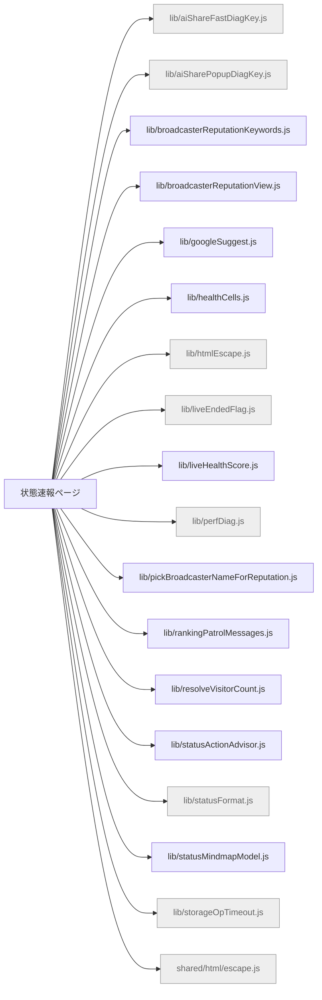

# 機能マップ: 状態速報ページ（`status`）

> `npm run feature-map` で再生成。手で編集しない。
> 起点 entry: `src/extension/status-entry.js`

## storage の出入り

- 書くキー: (なし)
- 読むキー: `KEY_AI_SHARE_FAST_DIAG`, `KEY_AI_SHARE_POPUP_DIAG`, `KEY_LAST_WATCH_URL`, `nls_backfill_progress_v1`

## 構成ファイル（import 到達・最大40件表示）

