# 機能マップ: 会場モード(standalone)（`venue`）

> `npm run feature-map` で再生成。手で編集しない。
> 起点 entry: `src/extension/venue-entry.js`

## storage の出入り

- 書くキー: `KEY_BGM_PHASE_DIAG`, `KEY_GIFT_EFFECT_DIAG`, `KEY_HIGHLIGHT_LEDGER`, `KEY_VENUE_EFFECT_SOUND_PRESENCE`, `KEY_VENUE_SEATS_DIAG`, `KEY_VOICE_DIAG`, `KEY_VOICE_EFFECT_DIAG`
- 読むキー: `KEY_BGM_ENABLED`, `KEY_BGM_VOLUME_FEVER`, `KEY_BGM_VOLUME_REACH`, `KEY_EFFECT_SOUND_ENABLED`, `KEY_HIGHLIGHT_LEDGER`, `KEY_LANE_MIRROR`, `KEY_LIVE_BROADCASTER_CTX`, `KEY_USER_COMMENT_PROFILE_CACHE`

## 構成ファイル（import 到達・最大40件表示）

```mermaid
graph LR
  n_venue["会場モード(standalone)"]
  n_venue --> n_src_domain_lane_columns_kontaPolicy_js["domain/lane/columns/kontaPolicy.js"]:::shared
  n_venue --> n_src_domain_lane_columns_linkPolicy_js["domain/lane/columns/linkPolicy.js"]:::shared
  n_venue --> n_src_domain_lane_columns_tanuPolicy_js["domain/lane/columns/tanuPolicy.js"]:::shared
  n_venue --> n_src_domain_lane_tier_js["domain/lane/tier.js"]:::shared
  n_venue --> n_src_domain_user_identity_js["domain/user/identity.js"]:::shared
  n_venue --> n_src_domain_user_nickname_js["domain/user/nickname.js"]:::shared
  n_venue --> n_src_extension_story_renderStoryUserLaneDom_js["extension/story/renderStoryUserLaneDom.js"]:::shared
  n_venue --> n_src_extension_venueBar_js["extension/venueBar.js"]:::shared
  n_venue --> n_src_lib_anonymousIdenticon_js["lib/anonymousIdenticon.js"]:::shared
  n_venue --> n_src_lib_arrivalEffect_js["lib/arrivalEffect.js"]:::shared
  n_venue --> n_src_lib_avatarBroadcasterGuard_js["lib/avatarBroadcasterGuard.js"]:::shared
  n_venue --> n_src_lib_avatarPartsComposer_js["lib/avatarPartsComposer.js"]:::shared
  n_venue --> n_src_lib_avatarUrlCompare_js["lib/avatarUrlCompare.js"]:::shared
  n_venue --> n_src_lib_backfillRemoveRecommendedLivePollution_js["lib/backfillRemoveRecommendedLivePollution.js"]:::shared
  n_venue --> n_src_lib_bgmDirector_js["lib/bgmDirector.js"]:::shared
  n_venue --> n_src_lib_bgmPhaseDiag_js["lib/bgmPhaseDiag.js"]:::shared
  n_venue --> n_src_lib_bgmPhaseDiagKey_js["lib/bgmPhaseDiagKey.js"]:::shared
  n_venue --> n_src_lib_broadcastContext_js["lib/broadcastContext.js"]:::shared
  n_venue --> n_src_lib_celebrationCharaAssets_js["lib/celebrationCharaAssets.js"]:::shared
  n_venue --> n_src_lib_comeviewRows_js["lib/comeviewRows.js"]:::shared
  n_venue --> n_src_lib_commentChunkStore_js["lib/commentChunkStore.js"]:::shared
  n_venue --> n_src_lib_commentRecord_js["lib/commentRecord.js"]:::shared
  n_venue --> n_src_lib_commentTailBuffer_js["lib/commentTailBuffer.js"]:::shared
  n_venue --> n_src_lib_crowdRasterizer_js["lib/crowdRasterizer.js"]:::shared
  n_venue --> n_src_lib_customSoundPreset_js["lib/customSoundPreset.js"]:::shared
  n_venue --> n_src_lib_customSoundStore_js["lib/customSoundStore.js"]:::shared
  n_venue --> n_src_lib_deriveAvatarUrlFromUid_js["lib/deriveAvatarUrlFromUid.js"]:::shared
  n_venue --> n_src_lib_effectDirector_js["lib/effectDirector.js"]:::shared
  n_venue --> n_src_lib_effectSoundPlayer_js["lib/effectSoundPlayer.js"]:::shared
  n_venue --> n_src_lib_giftDeltaFallback_js["lib/giftDeltaFallback.js"]:::shared
  n_venue --> n_src_lib_giftDisplayNickname_js["lib/giftDisplayNickname.js"]:::shared
  n_venue --> n_src_lib_giftEffectDiag_js["lib/giftEffectDiag.js"]:::shared
  n_venue --> n_src_lib_giftEffectDiagKey_js["lib/giftEffectDiagKey.js"]:::shared
  n_venue --> n_src_lib_giftThrowProjectile_js["lib/giftThrowProjectile.js"]:::shared
  n_venue --> n_src_lib_highlightLedger_js["lib/highlightLedger.js"]:::shared
  n_venue --> n_src_lib_highlightLedgerKey_js["lib/highlightLedgerKey.js"]:::shared
  n_venue --> n_src_lib_htmlEscape_js["lib/htmlEscape.js"]:::shared
  n_venue --> n_src_lib_laneMirror_js["lib/laneMirror.js"]:::shared
  n_venue --> n_src_lib_laneMirrorKey_js["lib/laneMirrorKey.js"]:::shared
  n_venue --> n_src_lib_nicoAnonymousDisplay_js["lib/nicoAnonymousDisplay.js"]:::shared
  classDef shared fill:#eee,stroke:#999,color:#666;
```

> ほか 66 ファイル省略（全件は storage-bus.md / metafile 参照）。
