# 機能マップ: 会場モード(standalone)（`venue`）

> `npm run feature-map` で再生成。手で編集しない。
> 起点 entry: `src/extension/venue-entry.js`

## storage の出入り

- 書くキー: `KEY_VENUE_SEATS_DIAG`
- 読むキー: `KEY_LIVE_BROADCASTER_CTX`, `KEY_USER_COMMENT_PROFILE_CACHE`

## 構成ファイル（import 到達・最大40件表示）

```mermaid
graph LR
  n_venue["会場モード(standalone)"]
  n_venue --> n_src_domain_user_identity_js["domain/user/identity.js"]:::shared
  n_venue --> n_src_extension_venueBar_js["extension/venueBar.js"]:::shared
  n_venue --> n_src_lib_anonymousIdenticon_js["lib/anonymousIdenticon.js"]:::shared
  n_venue --> n_src_lib_avatarBroadcasterGuard_js["lib/avatarBroadcasterGuard.js"]:::shared
  n_venue --> n_src_lib_avatarPartsComposer_js["lib/avatarPartsComposer.js"]:::shared
  n_venue --> n_src_lib_avatarUrlCompare_js["lib/avatarUrlCompare.js"]:::shared
  n_venue --> n_src_lib_backfillRemoveRecommendedLivePollution_js["lib/backfillRemoveRecommendedLivePollution.js"]:::shared
  n_venue --> n_src_lib_broadcastContext_js["lib/broadcastContext.js"]:::shared
  n_venue --> n_src_lib_celebrationCharaAssets_js["lib/celebrationCharaAssets.js"]:::shared
  n_venue --> n_src_lib_comeviewRows_js["lib/comeviewRows.js"]:::shared
  n_venue --> n_src_lib_commentChunkStore_js["lib/commentChunkStore.js"]:::shared
  n_venue --> n_src_lib_commentRecord_js["lib/commentRecord.js"]:::shared
  n_venue --> n_src_lib_commentTailBuffer_js["lib/commentTailBuffer.js"]:::shared
  n_venue --> n_src_lib_crowdRasterizer_js["lib/crowdRasterizer.js"]:::shared
  n_venue --> n_src_lib_deriveAvatarUrlFromUid_js["lib/deriveAvatarUrlFromUid.js"]:::shared
  n_venue --> n_src_lib_giftDisplayNickname_js["lib/giftDisplayNickname.js"]:::shared
  n_venue --> n_src_lib_giftThrowProjectile_js["lib/giftThrowProjectile.js"]:::shared
  n_venue --> n_src_lib_nicoAnonymousDisplay_js["lib/nicoAnonymousDisplay.js"]:::shared
  n_venue --> n_src_lib_nicoUserPage_js["lib/nicoUserPage.js"]:::shared
  n_venue --> n_src_lib_parseGiftComment_js["lib/parseGiftComment.js"]:::shared
  n_venue --> n_src_lib_personTileDom_js["lib/personTileDom.js"]:::shared
  n_venue --> n_src_lib_popupAvatarResolver_js["lib/popupAvatarResolver.js"]:::shared
  n_venue --> n_src_lib_reportSilentError_js["lib/reportSilentError.js"]:::shared
  n_venue --> n_src_lib_storageKeys_js["lib/storageKeys.js"]:::shared
  n_venue --> n_src_lib_storageOpTimeout_js["lib/storageOpTimeout.js"]:::shared
  n_venue --> n_src_lib_storyAvatarTvFallbackClass_js["lib/storyAvatarTvFallbackClass.js"]:::shared
  n_venue --> n_src_lib_storyTileTvStyle_js["lib/storyTileTvStyle.js"]:::shared
  n_venue --> n_src_lib_storyUserLaneMeta_js["lib/storyUserLaneMeta.js"]:::shared
  n_venue --> n_src_lib_supportGridDisplayTier_js["lib/supportGridDisplayTier.js"]:::shared
  n_venue --> n_src_lib_supportGrowthAvatarLoad_js["lib/supportGrowthAvatarLoad.js"]:::shared
  n_venue --> n_src_lib_supportGrowthTileSrc_js["lib/supportGrowthTileSrc.js"]:::shared
  n_venue --> n_src_lib_userIdPreference_js["lib/userIdPreference.js"]:::shared
  n_venue --> n_src_lib_userLaneCandidatesFromStorage_js["lib/userLaneCandidatesFromStorage.js"]:::shared
  n_venue --> n_src_lib_userRooms_js["lib/userRooms.js"]:::shared
  n_venue --> n_src_lib_venueAvatar_js["lib/venueAvatar.js"]:::shared
  n_venue --> n_src_lib_venueBubbleLayout_js["lib/venueBubbleLayout.js"]:::shared
  n_venue --> n_src_lib_venueBubbleLifecycle_js["lib/venueBubbleLifecycle.js"]:::shared
  n_venue --> n_src_lib_venueCharacterFrame_js["lib/venueCharacterFrame.js"]:::shared
  n_venue --> n_src_lib_venueCrowdMotion_js["lib/venueCrowdMotion.js"]:::shared
  n_venue --> n_src_lib_venueDisplayRows_js["lib/venueDisplayRows.js"]:::shared
  classDef shared fill:#eee,stroke:#999,color:#666;
```

> ほか 21 ファイル省略（全件は storage-bus.md / metafile 参照）。
