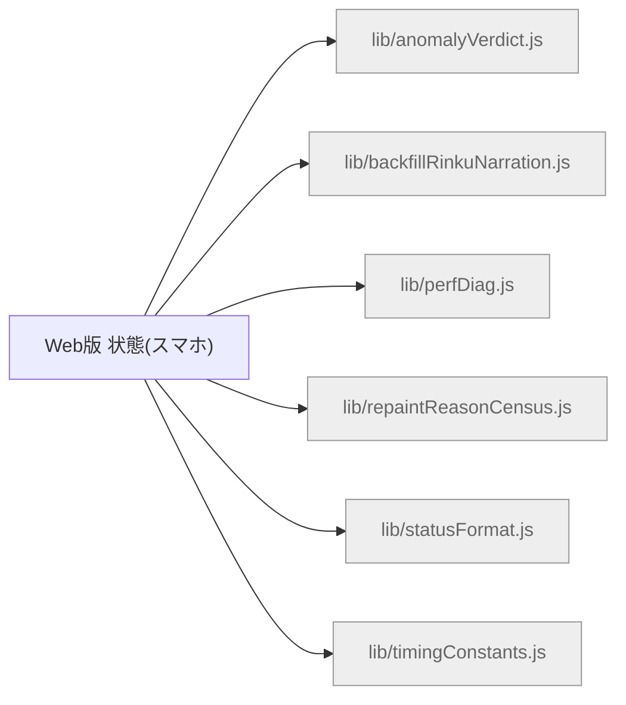

# 機能マップ: Web版 状態(スマホ)（`web-status`）

> `npm run feature-map` で再生成。手で編集しない。
> 起点 entry: `app/app.js`

## storage の出入り

- 書くキー: (なし)
- 読むキー: (なし)

## 構成ファイル（import 到達・最大40件表示）

```mermaid
graph LR
  n_web_status["Web版 状態(スマホ)"]
  n_web_status --> n_src_lib_anomalyVerdict_js["lib/anomalyVerdict.js"]:::shared
  n_web_status --> n_src_lib_backfillRinkuNarration_js["lib/backfillRinkuNarration.js"]:::shared
  n_web_status --> n_src_lib_perfDiag_js["lib/perfDiag.js"]:::shared
  n_web_status --> n_src_lib_repaintReasonCensus_js["lib/repaintReasonCensus.js"]:::shared
  n_web_status --> n_src_lib_statusFormat_js["lib/statusFormat.js"]:::shared
  n_web_status --> n_src_lib_timingConstants_js["lib/timingConstants.js"]:::shared
  classDef shared fill:#eee,stroke:#999,color:#666;
```
