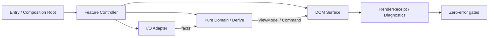

# コンポーネント化・ファクタリング設計／実装ハンドオフ

> 目的: コードをただ小分けにするのではなく、正本・副作用・ライフサイクルを一本化し、
> 「既知エラー 0 / 未捕捉例外 0 / 退行 0」で段階的に着地させる。
>
> 作成日: 2026-08-01
>
> この文書を作った時点では **コード、build、version、dist を一切変更していない**。
> 実装前に本書を承認し、Phase ごとに別 patch として進めること。
>
> 視覚フロー: [../component-factoring-zero-error-flow.html](../component-factoring-zero-error-flow.html)

## 0. 結論

最初にやるべきことは巨大ファイルの分割ではない。現在併存している **実稼働の旧経路** と
**テスト済みだが実表示を支配していない新経路**を、出力比較できる状態にすることである。

特に次の2点を先に解消しない限り、コンポーネント化してもエラーは減らない。

1. `laneStoreInstance` は `popup-entry.js` から `setCandidates()` されるが、production code に
   `subscribe()` / `getState()` の利用がない。画面の正本は今も `STORY_SOURCE_STATE` と
   `userLaneCandidatesFromStorage()` である。新旧が **shadow と live に分裂**している。
2. `src/domain/user/avatarResolver.js` は自ら「未配線(dead code)」と明記している。22ケースのテストが
   緑でも、本番のアバター表示を守ってはいない。

したがって移行は必ず次の一本の状態機械で行う。

```text
BASELINE
  → DUAL_RUN（旧だけを表示、新は比較だけ）
  → PARITY_PROVEN（差分0を機械確認）
  → AUTHORITY_SWITCH（新を正本に切替、旧はfallback）
  → LEGACY_REMOVAL（1 patch 後に旧系を削除）
  → ZERO_ERROR_RELEASE
```

旧系と新系を同時に画面へ書かせない。差分が1件でもある間は `AUTHORITY_SWITCH` へ進まない。

## 1. 「エラー0」の定義

「コンソールを隠す」「catchして捨てる」はエラー0ではない。本タスクの完了は、以下の5層が全部0の状態。

| 層 | 0の意味 | 証拠 |
|---|---|---|
| 静的 | lint / typecheck / import / map / version の赤が0 | `npm run verify:cc` 9 STEP 全緑 |
| テスト | unit / characterization / contract / E2E の失敗が0 | ログと件数 |
| 実行時 | current build由来の uncaught / unhandled rejection / Chrome拡張エラーが0 | error panelを一度消して同buildで再現確認 |
| データ | storage payload、記録件数、レーン人物集合、診断JSONの意図しない差分が0 | 旧新dual-run比較、DOM fingerprint |
| 性能 | storage書込、DOM貼替、long task、初回表示の退行が0 | 変更前baseline以下、またはノイズ幅10%以内 |

MV3の一時的な外部要因は `expected-transient` として分類してよい。ただし分類されていない例外を
warnへ降格して数を消すことは禁止する。「実害0」と「ログ0」を混同しない。

## 2. 現状の機械的事実

2026-08-01 の `master`（v0.1.1215）を読み取り専用で棚卸しした値。

| ファイル | 物理行数 | import文 | 主な集中責務 |
|---|---:|---:|---|
| `src/extension/popup-entry.js` | 22,066 | 291 | 3画面共通起動、レーン、北極星、送信、演出、export、診断 |
| `src/extension/content-entry.js` | 18,681 | 176 | 取得、記録、inline host、snapshot、backfill、外部API、診断 |
| `src/extension/venueBar.js` | 6,056 | 80 | 席、5段、吹き出し、読み上げ、ギフト、集計、全listener/timer |
| `src/extension/status-entry.js` | 3,375 | 83 | storage読取、集約、診断UI、公開payload、設定 |

大きい関数・クロージャ:

| 優先 | 関数 | 現在の規模 | 判断 |
|---:|---|---:|---|
| P0 | `popup-entry.js#initPopup` | 約2,588行 | composition rootとして残し、feature controllerを外へ出す |
| P0 | `popup-entry.js#refresh` | 約1,779行 | 順序とcancel契約を固定後、read/derive/paintを分ける |
| P0 | `venueBar.js#mountVenueBarButton` | 約3,979行 | closureを丸ごと移さず、所有timer/listener単位で抽出 |
| P1 | `content-entry.js#buildGiftDiagnosticsBundle` | 約916行 | facts入力のbuilderへ抽出候補 |
| P1 | `content-entry.js#collectWatchPageSnapshot` | 約520行 | DOM read adapter + pure builderへ分離 |
| P1 | `content-entry.js#buildAiSharePageDiagnostics` | 約396行 | pure builderへ抽出候補 |
| P1 | `popup-entry.js#renderStoryUserLane` | 約339行 | view-model生成とDOM commitを分ける |
| P1 | `popup-entry.js#computeGiftHistoryNorthStarRoomsContext` | 約317行 | async I/O shellとpure deriveを分ける |
| P1 | `venueBar.js#renderSeats` | 約524行 | Scene commit componentへ抽出候補 |

既に正本化できている資産は作り直さない。

- 人物タイル: `src/lib/personTileDom.js#buildPersonTileEl`
- 5段DOM: `src/extension/story/renderStoryUserLaneDom.js#paintStoryUserLaneDomFilled`
- 会場の段変換: `src/lib/venueLaneBuckets.js`
- Scene一致証明: `src/lib/laneSceneEnvelope.js`
- 記録件数表示: `src/lib/displayRecordedCount.js#selectDisplayRecordedCount`
- 安全なstorage: `src/lib/safeStorageLocal.js`
- 既存の純関数群: `src/lib/`、`src/domain/`、`src/data/`

## 3. いま最も危険な構造

### 3.1 レーンの二重正本

実稼働:

```text
stored/comment/intercept
  → userLaneCandidatesFromStorage
  → STORY_SOURCE_STATE.laneAggregates
  → renderStoryUserLane
  → paintStoryUserLaneDomFilled
```

新設されたshadow:

```text
stored comments
  → laneCandidatesFromStoredComments
  → laneStoreInstance.setCandidates
  → （production subscriberなし）
```

`laneStore` を「正本」と呼んでも、表示consumerがいないため正本ではない。先に旧新の出力を
同一fixtureで比較し、人物キー・tier・順序・avatar・nicknameが完全一致するまで切替禁止。

### 3.2 アバターの二重正本

`avatarResolver.js` は設計上の正本だが未配線。実稼働では
`storyGrowthAvatarSrcCandidate`、`resolveStoryLaneAvatarSrc`、profile cache、venue enrich等が動く。
新resolverを即配線すると過去のwatchMeta回帰を再現し得る。まず入力観測を同じ形に正規化し、
旧出力とresolver出力を比較する。

### 3.3 entryの巨大さより危険な隠れ依存

関数は次を暗黙参照している。

- module state（`STORY_SOURCE_STATE`, `watchMetaCache`, `refreshGen`, 各種cache）
- DOM IDと親子順序
- `chrome.storage.onChanged`、runtime message、timerの登録順
- `INLINE_MODE` / `INLINE_PASSIVE` / standalone の3画面モード
- 同一tick内の「read → light paint → heavy paint → mirror publish」の順序

関数本体だけ別ファイルへ移すと、状態共有、解除、更新順が変わる。抽出単位は「行数」ではなく
**所有する状態・listener・timer・DOM rootが閉じる単位**にする。

## 4. 目標アーキテクチャ

フレームワークは導入しない。現在のバニラJS + esbuild + pure function文化を維持する。



依存方向は一方向だけ。

```text
entry → controller → adapter / domain / surface
domain → shared のみ
surface → domain/shared は可、entry/controller は不可
adapter → domain/shared は可、surface は不可
```

### 4.1 コンポーネント契約

UI componentはReact componentではなく、次の明示契約を持つ関数モジュールとする。

```js
createFeatureController({ root, storage, runtime, clock, scheduler, diagnostics })
  → {
      start(),
      update(input),
      dispose(),
      getSnapshot()
    }
```

必須不変条件:

1. `start()` 二重呼出しでもlistener/timerが二重登録されない。
2. 登録したlistener/timer/observerは同じcomponentの `dispose()` が全解除する。
3. `update()` は自分のroot外をqueryしない。
4. storage書込はadapter経由。component内部で新しい直書きを作らない。
5. 診断失敗はUIを止めないが、業務処理の失敗は握り潰さない。
6. `liveId` 切替時は旧非同期結果をcommitしない。

### 4.2 entryに残すもの

- mode判定と起動順
- component生成、依存注入、start/dispose
- Chrome lifecycleの最上位配線
- refresh世代番号とcancel判断の最上位
- fatal error boundary

### 4.3 entryから出すもの

- 入力からobject/string/view-modelを組み立てる処理
- 1つのDOM rootだけを所有する描画
- 1機能だけのtimer/listener/observer
- 診断snapshot builder
- feature固有のstorage read/write adapter

## 5. 実装フェーズ

各Phaseは **別branch・別patch・別commit**。Planにないファイルが必要なら停止して本書を更新する。

### Phase 0 — baseline凍結（挙動変更なし）

目的: 分割前の出力・副作用・性能を保存する。

追加する証拠:

- 5 surface: 通常popup / inline / passive preview / venue / status
- レーン: userKey列、tier別件数、DOM fingerprint、鏡revision/hash
- 記録: `recordedCountForDisplay`、chunk/tail/IDBの件数
- storage: 主要keyのpayload hashと書込回数
- runtime: uncaught、unhandledrejection、context invalidated分類
- 性能: 初回表示、refresh、lane paint、venue first-seat、DOM repaint回数

完了条件:

1. 現行masterで `npm run verify:cc` 全緑。
2. characterization testが現行出力を固定する。
3. テストを `if (false)`、呼出し削除、hot pathへの`.filter(`で変異させ、意図どおり赤になる。
4. 実装ロジックは変更しない。

rollback: test/doc追加commitをrevertするだけ。storage migrationなし。

### Phase 1 — 二重正本を可視化（旧系がauthorityのまま）

対象:

- `userLaneCandidatesFromStorage` vs `laneCandidatesFromStoredComments`
- `STORY_SOURCE_STATE`由来buckets vs `laneStore`由来buckets
- 現行avatar chain vs `avatarResolver`

やること:

1. 旧と新へ同一入力を渡すpure comparatorを作る。
2. 比較項目を `userKey / tier / order / displaySrc / nickname / count` に固定する。
3. 旧系だけを画面へcommitする。新系は比較結果を返すだけ。
4. productionで差分を永続化しない。既存診断のbounded/min-gap経路へ集計値だけ載せる。

完了条件:

- unit fixtureで差分0。
- 匿名主体、数値ID、配信者、自投稿、gift/ad、欠損avatarの反例が全部0。
- 実配信サンプルでも差分0になるまでauthority switch禁止。

rollback: comparatorの呼出しを外すだけ。表示は最初から旧系なので無影響。

### Phase 2 — pure builder抽出（最も安全・効果最大）

1 patchにつき1関数。優先順:

1. `buildGiftDiagnosticsBundle` — module stateを `GiftDiagnosticsFacts` 引数へ列挙。
2. `buildAiSharePageDiagnostics` — object出力をバイト一致で固定。
3. `collectWatchPageSnapshot` — `readWatchPageFacts()` と `buildWatchPageSnapshot(facts)` に分離。
4. `computeGiftHistoryNorthStarRoomsContext` — storage/API read shellとderiveを分離。
5. `collectAiShareDevMonitorPayloadBundle` — pure payload builderを抽出。

禁止:

- ロジック改善、命名変更、出力整形を同じpatchに混ぜない。
- JSON fieldの追加・削除・順序変更をしない。
- new storage key/writeを作らない。

完了条件:

- 抽出前後のobject/HTML/JSONがバイト一致。
- entryは `import + facts作成 + 1 call` だけになる。
- max-lines ratchetを抽出後の実値へ下げる。
- entryから新moduleへの一方向importのみ。

### Phase 3 — popupをfeature controller化

`initPopup` はcomposition rootとして残す。次の順で外へ出す。

1. `popupFrameSettingsController` — frame設定root、storage、listener、dispose。
2. `popupExportController` — HTML/JSON/media-kit exportの進行状態とbutton群。
3. `popupCommentComposeController` — editor、送信、shortcut、optimistic paint。
4. `popupEffectsController` — voice/BGM/phase/op sound。既存director pure modulesを再利用。
5. `popupStorageRefreshController` — onChanged分類とcoalesced refresh要求。

`refresh` は次の状態遷移を維持する。

```text
IDLE
 → CORE_READING
 → LIGHT_PAINTED
 → HEAVY_READING
 → HEAVY_PAINTED
 → MIRRORS_PUBLISHED
 → COMPLETE

任意のawait後にrefreshGen不一致 → CANCELLED（DOM commit禁止）
INLINE_PASSIVE → mirror readだけ。heavy read/write/fetch禁止。
```

完了条件:

- 3画面の初期DOM、listener数、timer数、storage read/write列がbaseline一致。
- `start()`二重実行で二重登録0。
- `dispose()`後のイベント反応0。
- passiveからstorage write/fetch 0。

### Phase 4 — 応援レーンを1 componentへ収束

正本として再利用:

- modelの入口: 旧新parityが成立した方1本
- tile: `buildPersonTileEl`
- surface: `paintStoryUserLaneDomFilled`
- scene proof: `laneSceneEnvelope`

作る境界:

```text
LaneSupplyAdapter
  → buildStoryLaneViewModel(facts)
  → StoryLaneSurface.commit(viewModel)
  → RenderReceipt
```

`buildStoryLaneViewModel` に閉じるもの:

- broadcaster/self/contamination判定
- candidate dedupe
- avatar resolve結果
- sort/tier/bucket
- diagnostic counts
- stable render signature

Surfaceに閉じるもの:

- root取得
- empty/filled commit
- diff-skip
- DOM census
- mirror publishに渡すreceipt

完了条件:

- popup、passive、venueの人物集合・順序・tierが期待する契約どおり。
- `buildPersonTileEl` を別実装しない。
- paint中の全段 `querySelectorAll` 0。
- 時刻をrender signatureへ混ぜない。
- 同一view-model再commit時のDOM貼替0。

### Phase 5 — venue runtimeを所有権ごとに分割

`mountVenueBarButton` を一括移動しない。次のleafから1つずつ。

| component | 現行の中心 | 所有するもの |
|---|---|---|
| `venueVoiceController` | `publishVenueVoiceDiag` 周辺 | VoicePlayer、voice timer、diag |
| `venueEffectsController` | `scheduleGiftSound` / phase director | gift/BGM/effect timer、Audio |
| `venueSpeechController` | `showSpeechBubble` / `processSpeechRows` | bubble DOM、speech queue、poll |
| `venueSceneController` | `renderSeats` | 5段/席/crowd commit、receipt |
| `venueAggregationController` | `aggregateParticipants` | chunk差分、single-flight、cache |
| `venueLifecycleController` | `handleStorageChange` / `setOpen` | onChanged、pagehide、open/close |

共通の `VenueRuntimeContext` は値の袋に限定し、何でもできるgod objectにしない。
各controllerが所有するtimer/listenerは重複させず、必ずdispose可能にする。

完了条件:

- open/close 10回でlistener/timer数が増えない。
- first paint / first seatがbaselineより悪化しない。
- bubble/gift/voiceの検知→発火→diag内訳が保存される。
- 会場5段は既存`paintStoryUserLaneDomFilled`を使う。
- host/iframe/CSS/DOM構造はこのPhaseで変更しない。

### Phase 6 — content runtimeを高リスク順の逆で分割

安全な順:

1. snapshot/diagnostics controller
2. external mirror acquisition controller
3. inline host layout controller
4. backfill controller
5. comment recording controller（最後）

記録系を最後にする理由: IDB/chunk/tail/offscreen/SWのフォールバック順と重複排除が最重要で、
component化の副作用で二重保存・欠落を起こす危険が最も高い。

記録componentの不変条件:

- 同一入力の保存件数・dedupe key・chunk/tail payloadが一致。
- fallback順を変えない。
- `recordedCountForDisplay` の正本を変えない。
- `liveId` 切替時に旧配信のbufferを新配信へ書かない。
- context invalidated時は自己停止し、listenerを解除する。

### Phase 7 — authority switchとlegacy削除

一度に切替・削除しない。

Patch A:

- 新component/新modelをauthorityへ。
- 旧関数はfallbackとして残す。
- 旧新比較は継続。

Patch B（次patch、実機緑の後）:

- fallback発火0を確認。
- 旧import/call/siteを削除。
- transitional shim/dead resolver/shadow storeを「使う」か「消す」か確定し、中間状態を残さない。
- docs/MAP、tree-map、feature-mapを更新。

完了条件:

- 1概念1正本。
- productionから未購読store、未配線resolver、移行予定コメントが消える。
- import cycle 0。
- max-linesを戻せない機械ゲートがある。

## 6. ゼロエラー検証マトリクス

### 6.1 毎patch必須

1. 対象unit/characterization test。
2. `npm run impact-check` で波及先列挙。
3. `npm run verify:cc` の9 STEP全緑:
   - test
   - lint
   - typecheck
   - build
   - tracked-imports
   - tree-map
   - site-health
   - feature-map
   - verify:bump
4. 新規fileは明示的にstage。
5. `git diff --cached` でPlan外変更0。

### 6.2 component contract tests

- start二重呼出し → listener/timer 1組。
- dispose → listener/timer/observer 0。
- stale generation → DOM/storage commit 0。
- 同一input再update → DOM replace 0。
- adapter失敗 → 明示result、未捕捉例外0。
- diagnostics失敗 → 本体継続、診断失敗は観測可能。

### 6.3 parity tests

- 旧新のuserKey列完全一致。
- tier別順序完全一致。
- avatar/nickname/link完全一致。
- DOM fingerprint一致。
- mirror revision/hash/receipt一致。
- storage payload hash、message payload、write回数一致。
- HTML/JSON/text builderはバイト一致。

### 6.4 E2E surface matrix

| surface | 必須確認 |
|---|---|
| 通常popup | 初回表示、refresh、送信、export、閉じ直し |
| inline | 配置、SPA配信切替、comment push、再描画 |
| passive | mirror-only、書込0、heavy read 0、明滅0 |
| venue | open/close、全段、席、吹き出し、voice/gift、長時間 |
| status | 初回load、定期refresh、AI共有、live-view publish |

### 6.5 実機の最終判定

1. 現在buildのChrome拡張エラーを消す。
2. 拡張reload + watch F5。
3. 5 surfaceを1巡。
4. 通常配信と匿名主体配信を確認。
5. 30分以上のlong-runでlistener/timer/storage/DOM churnが増え続けない。
6. 同じbuild由来の新しい赤エラー0、未分類warn 0。

## 7. 触ってはいけないもの

- `MEMORY.md` / `memory/reference_*.md`（司令塔専用）
- host/iframe構造、loading幕、配置をcomponent化と同時に変更しない
- storage schema/key/保持件数をrefactorと同時に変更しない
- manifest権限を変更しない
- `copy:ext` を配信視聴中に実行しない
- popup/venueで同じ人物タイルを再実装しない
- pure moduleからentryをimportしない
- global catchで例外をwarnへ隠さない
- 新フレームワーク・DIコンテナ・repository/service三層を導入しない
- 1 patchで複数componentまたはauthority switch+legacy削除を行わない

## 8. 失敗時rollback

全Phaseでstorage migrationを行わないため、rollbackはコードcommitのrevertだけで成立させる。

- DUAL_RUN中: comparatorを外す。旧表示は無変更。
- AUTHORITY_SWITCH直後: 1commit revertで旧authorityへ。
- controller抽出: entryの旧callを戻し、新moduleを外す。
- runtime異常: 追加実装を止め、baselineとの差が出た最小patchまで戻す。

「修正を重ねて前進」は禁止。最初に赤になったPhaseへ戻る。

## 9. 実装者へ渡す指示文

```text
ROLE: このChrome拡張の段階的リファクタ担当。

SOURCE OF TRUTH:
1. AGENTS.md §3 / §10 / §12
2. docs/handoff/component-factoring-zero-error-IMPLEMENTATION-HANDOFF.md
3. docs/component-factoring-zero-error-flow.html
4. docs/MAP.md と対象feature-map

今回実装するPhaseを1つだけ選び、最初に目的・非目的・変更ファイル・状態遷移・
rollback・検証をPlanとして提示する。承認前はRead/Grep/git diffだけ。

絶対条件:
- 旧新二重経路は旧をauthorityにしたDUAL_RUNから始める。
- 差分が1件でもあればauthority switchしない。
- 1 component / 1 patch。
- 新しいstorage書込、権限、host/iframe、UI仕様変更を混ぜない。
- output/DOM/storage/messageはcharacterizationで同値証明する。
- wiring testは実際にif(false)等で壊して赤になることを確認する。
- npm run verify:cc全緑。新規fileを明示stage。pushはしない。

完了報告:
- 変更ファイルと関数
- 旧新parity結果
- verify:cc 9 STEP
- mutation結果
- 実機結果
- 残る差分/質問
```

## 10. 最終Doneチェック

- [ ] `laneStore` が本当のauthorityか、削除済みかのどちらか（shadow禁止）
- [ ] `avatarResolver` が本番authorityか、削除済みかのどちらか（dead正本禁止）
- [ ] popup/content/venue/status entryはcomposition rootになっている
- [ ] featureごとにstate/listener/timer/rootの所有者が1つ
- [ ] start/dispose contractがテストされている
- [ ] 旧新parity差分0
- [ ] DOM/storage/messageの意図しない差分0
- [ ] static/test/runtime/data/performanceの5層で赤0
- [ ] `verify:cc` 全緑
- [ ] Chrome current buildの新規エラー0
- [ ] docs/MAP/tree-map/feature-mapが現実と一致

ここまで満たして初めて「コンポーネント化完了」「エラー0」と宣言する。
