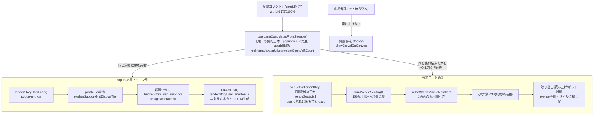

# 人物タイル経路 設計マインドマップ（正本・手書き）

> 設計意図の正本。`docs/feature-map/`(自動生成・import グラフ)とは別物で、こちらは「なぜこうなっているか・誰が正本か・方針の変遷」を人間も AI も誤らないために手書きで保つ。
> 関連: [council/person-tile-unify-SYNTHESIS.md](../council/person-tile-unify-SYNTHESIS.md)（会議統合）/ [docs/feature-map/venue.md](feature-map/venue.md)・[popup.md](feature-map/popup.md)（自動生成の依存図）
> 最終更新 2026-06-17。

## これは何
ニコ生視聴者を表す「丸いサムネイル（人物タイル）」が、popup の応援アイコン列と会場モードの席で、どう同じデータから描かれるか。「popup に出るのに会場に出ない」を二度と起こさないための正本図。

## 用語の正本（取り違え厳禁）

| 用語 | 定義 | 会場での扱い | データ源 |
|---|---|---|---|
| **アクティブユーザー** | コメント/ギフト/広告(貢献)でアクションし、userId が観測できた人。**匿名(a:xxx)/非匿名は無関係** | **全員、席に座る**（顔が見える） | 記録コメント行(userId 付き) |
| **来場者数(PV)** | ニコ生公式「来場 N人」。延べアクセス・同じ人の入り直し・無言の通りすがり込み | 席には出せない（userId 取れない）→**背景群衆 Canvas の密度**で表現 | 公式値(NDGR/DOM) |
| **ほか N人**（旧「ほか観客 N人」） | アクティブユーザーのうち、1画面に表示した席(visibleSeats)に入りきらなかった分。**匿名とは限らず数値IDも含む**(席に座った人は excludeKeys で除外済み) | 観客席にゆっくり顔 or 人数テキスト | rows − visibleSeatKeys |

⚠️ **「会場参加者 N人」(席=アクティブ) と「来場 N人」(PV) は全く別物**。混同しない。無言視聴者一覧は NDGR で取れないのが原理的制約（venueSeats.js 冒頭・Codex 指摘）。

## データフロー（正本）

## 正本ファイル（どれが「真実」か）

| 役割 | 正本ファイル/関数 | 注意 |
|---|---|---|
| **集約(誰がレーン候補か)** | `userLaneCandidatesFromStorage()` | popup/venue 共通。commentCount/giftCount を既に userId 単位で持つ |
| **席資格(誰が会場に座れるか)** | `venueParticipantKey()` (venueSeats.js) | userId あれば匿名も着席。座れない=null は「userIdも識別名も無い」1ケースだけ |
| **popup タイルDOM生成** | `buildPersonTileEl()` (personTileDom.js・第2コミットで切出し)。`fillLaneTier()` (renderStoryUserLaneDom.js) が呼ぶ | 丸サムネ+ID+名前のセル生成。リンク可否は `isNumericNicoUserId`(domain 正本・第3コミットで統一) |
| **席割り** | `buildVenueSeating()` (venueSeats.js) | 150席上限・入れ替え・安定席 |
| **表示間引き** | `selectStableVisibleMembers` / `resolveVisibleArenaCount` (venueBar.js) | 1画面に収める数。ここで落ちた分が「ほか N人」 |
| **来場者数の表現** | `drawCrowdOnCanvas` (crowdRasterizer.js) | 背景群衆。席とは別レイヤー |

## 方針の変遷（⚠️ 古い理解で誤らないため）

- **2026-06-13** 旧方針「匿名はアリーナじゃない＝名前のある人だけ席」← **撤回済み**
- **2026-06-14** 「匿名も userId があれば席に座らせる(満員感)」で撤回
- **2026-06-17** 「アクティブユーザー(アクションした人)は匿名/非匿名問わず全員着席」で確定。来場者数(PV)は背景群衆で別表現。

→ venueSeats.js の `venueParticipantKey` JSDoc が現行正本。drift は `venueSeats.test.js` の「方針ドリフト検知」ブロックが固定（旧方針に戻すと落ちる）。

## 「会場に出ない」の真因（実コードで確定・2026-06-17）

席資格は匿名込みで全員候補。それでも popup と顔ぶれが食い違う原因は席資格より後ろ：
1. **匿名コメントは DOM に userId が無い（番号セルではない）** — ⚠️**2026-06-18 実機DOM答え合わせで前提が覆った**: 配信中 watch(ニコニコ実況・匿名主体)を Claude-in-Chrome 検証すると **`.comment-number` は消えていない**(検出12行すべてに存在・`droppedNoNumber:0`=現行ゲートは1行も落とさない)。本当の断線は **匿名(184)コメントは DOM/React fiber に userId(hashedUserId)が一切無い**(70連鎖walk で確認)→ 番号ゲートを緩めても席に出せない。匿名 userId は NDGR(protobuf)にしか無い(v0.1.803 で取得済)。**∴ 第2コミット(番号緩和)は保留(凍結)=利得ゼロ・働くガードを弱めるだけ。** 第1(v0.1.820・受理門の正本化・挙動不変)は維持。真の経路は「NDGR 匿名 userId をレーン/席に通す」(lane-empty-uid-missing 系)。**再開条件**=ユーザー自身の配信で実際に番号無し行(noNumberRowCount>0)が観測された場合のみ。答え合わせ正本=[council/comment-number-missing-dom-rescue-SYNTHESIS.md](../council/comment-number-missing-dom-rescue-SYNTHESIS.md)。OneComme は DOM を読まず NDGR 直読みのため DOM 緩和の直接答え合わせ不可・受理原則(身元+本文・番号不要)のみ転用。
2. **席数150上限＋表示間引き**(visibleSeats) — 1画面に収まらない分が「ほか N人」へ
3. **描画が別物**(popup タイル vs venue 席) — popup は `buildPersonTileEl` に集約済(第2)。venue 席の DOM(.nlsb-seat 等)は席プール再利用/読み上げ連動で構造が別物のため DOM 自体は統一せず、**リンク判定など純粋ロジックを domain 正本に寄せて顔ぶれ一致**(第3)

## SYNTHESIS の段階導入（進捗）
- ✅ 第1(v0.1.816): `buildPersonProfilesFromRows`(userId に comments/gifts 畳み込む純関数・書き込みゼロ)
- ✅ 第2(v0.1.817): 丸サムネタイルDOMビルダー `buildPersonTileEl` を切り出し popup 置換(見た目不変)
- ✅ 第3(v0.1.818): リンク判定を domain 正本 `isNumericNicoUserId`(^\d{5,14}$)に統一(popup/venue 同基準・顔ぶれ一致)
- ✅ 第4(v0.1.819): 「ほか観客 N人」→「ほか N人」へラベル正本化(誤読の核「観客」語を除去)。**来場者数(PV)の実値取得→二層表示は別途**(venue に PV 実値が無く、取得経路の新規配線が要るため範囲外・過剰実装回避)
- 🧊 別: `.comment-number` 消失で DOM観測全捨ての件 — ✅第1(v0.1.820): 受理門を `isHarvestableNicoCommentRow` に正本化(挙動不変・ドリフト防止で価値あり維持) / ❄️第2: **凍結**(2026-06-18 実機DOMで番号セルは現存・匿名はDOMにuserId無しと確認→番号緩和は利得ゼロ。再開はユーザー配信で番号無し行が実観測された場合のみ)
