# リポジトリ ディレクトリマップ（自動生成）

> `scripts/repo-tree-map.mjs` が git 追跡ファイルから自動生成。**手で編集しない**（再生成で上書き）。
> 役割の一言説明は同スクリプトの `ROLES` 辞書が正本。**未記入**のディレクトリは下に ⚠️ で出るので `ROLES` に1行足す。
> 下にマインドマップ（GitHub で図として表示）→ ディレクトリ一覧 → 機能逆引き索引 の順。
> **全部の地図への入口: [MAP.md](MAP.md)** ／ 視覚ビュー: [repo-tree-map.html](repo-tree-map.html) ／ 機能依存図: [feature-map/index.md](feature-map/index.md) ／ 配置ルール正本: [AGENTS.md](../AGENTS.md) §4。

ルート直下の設定ファイル: 54 件（package.json / *.config.js / AGENTS.md 等）

## マインドマップ（自動生成・GitHub で図として表示）

> `ROLES` / `FEATURES` 辞書から自動生成。辞書を更新すれば図も自動更新。

### ディレクトリツリー（場所 → 役割）

```mermaid
graph LR
  ROOT["リポジトリ"]
  ROOT --> d0[".codex/ 〔Codex/エージェント〕"]
  d0 --> d0_0["agents/ 〔Codex/エージェント〕"]
  ROOT --> d1[".codex-osint/ 〔OSINT/調査〕"]
  ROOT --> d2["_docs/ 〔横断/KB〕"]
  ROOT --> d3["api/ 〔API〕"]
  ROOT --> d4["app/ 〔Web版〕"]
  d4 --> d4_0["dist/ 〔ビルド成果物〕"]
  d4 --> d4_1["images/ 〔Web版/画像〕"]
  ROOT --> d5["council/ 〔会議/設計〕"]
  d5 --> d5_0["auto/ 〔会議/自動生成〕"]
  ROOT --> d6["council-scout/ 〔会議/調査〕"]
  d6 --> d6_0["briefs/ 〔会議/原稿〕"]
  ROOT --> d7["docs/ 〔設計/レポート〕"]
  d7 --> d7_0["article-assets/ 〔記事/画像〕"]
  d7 --> d7_1["article-drafts/ 〔記事/下書き〕"]
  d7 --> d7_2["feature-map/ 〔依存図/自動生成〕"]
  d7 --> d7_3["handoff/ 〔引継ぎ/設計〕"]
  d7 --> d7_4["marketing/ 〔マーケ/原稿〕"]
  d7 --> d7_5["patent-unique-voice-reading-filing-final/ 〔特許/履歴〕"]
  d7 --> d7_6["policies/ 〔方針〕"]
  d7 --> d7_7["releases/ 〔リリース〕"]
  d7 --> d7_8["research/ 〔調査/レポート〕"]
  d7 --> d7_9["workflows/ 〔ワークフロー〕"]
  ROOT --> d8["extension/ 〔配布/manifest〕"]
  d8 --> d8_0["data/ 〔データ/応援〕"]
  d8 --> d8_1["dist/ 〔ビルド成果物〕"]
  d8 --> d8_2["images/ 〔画像〕"]
  d8 --> d8_3["sound/ 〔音声〕"]
  ROOT --> d9["memory/ 〔メモリ/知見〕"]
  d9 --> d9_0["archive/ 〔メモリ/履歴〕"]
  d9 --> d9_1["avatar-parts/ 〔アバター/画像〕"]
  ROOT --> d10["scripts/ 〔ビルド/自動生成〕"]
  d10 --> d10_0["lib/ 〔ビルド/共有〕"]
  d10 --> d10_1["xserver/ 〔デプロイ/webhook〕"]
  ROOT --> d11["sound-src/ 〔音声/素材〕"]
  d11 --> d11_0["soundeffect-lab/ 〔音声/素材〕"]
  ROOT --> d12["src/ 〔ソース〕"]
  d12 --> d12_0["data/ 〔コメント/取得〕"]
  d12 --> d12_1["domain/ 〔応援/集約/識別子〕"]
  d12 --> d12_2["extension/ 〔entry/記録/会場/応援〕"]
  d12 --> d12_3["fixtures/ 〔テスト〕"]
  d12 --> d12_4["images/ 〔画像〕"]
  d12 --> d12_5["lib/ 〔色/速度/コメント/レポート/純粋関数〕"]
  d12 --> d12_6["server/ 〔API/公開/ランキング〕"]
  d12 --> d12_7["shared/ 〔共有/アバター〕"]
  d12 --> d12_8["sound/ 〔音声〕"]
  ROOT --> d13["tests/ 〔テスト〕"]
  d13 --> d13_0["contract/ 〔テスト/契約〕"]
  d13 --> d13_1["e2e/ 〔テスト/E2E/描画〕"]
  d13 --> d13_2["helpers/ 〔テスト/共有〕"]
  ROOT --> d14["tools/ 〔ツール〕"]
  d14 --> d14_0["mcp-nicolive/ 〔MCP/診断〕"]
  ROOT --> d15["tsuioku-no-kirameki/ 〔LP/公開〕"]
  d15 --> d15_0["articles/ 〔記事/公開〕"]
  d15 --> d15_1["assets/ 〔LP/共有〕"]
  d15 --> d15_2["images/ 〔画像〕"]
  d15 --> d15_3["live/ 〔LP/公開/ランキング〕"]
  d15 --> d15_4["sound/ 〔音声/公開〕"]
```



### 機能逆引き（機能 → 担当ファイル）

```mermaid
graph LR
  HUB["機能"]
  HUB --> f0["コメント送信(確認/プロファイル)"]
  f0 --> f0_0["lib/commentSubmitConfirm.js"]
  f0 --> f0_1["lib/commentSubmitProfiling.js"]
  HUB --> f1["popup スクロール(要素を見せる)"]
  f1 --> f1_0["lib/nlMainScrollReveal.js"]
  HUB --> f2["会場ドラッグスクロール(パン)"]
  f2 --> f2_0["lib/venueDragScroll.js"]
  HUB --> f3["コメント収穫(DOM 観測)"]
  f3 --> f3_0["lib/commentHarvest.js"]
  f3 --> f3_1["lib/nicoliveDom.js"]
  HUB --> f4["過去ログ取得(バックフィル巡回)"]
  f4 --> f4_0["lib/ndgrBackfillCrawl.js"]
  HUB --> f5["コメント重複除去(NDGR)"]
  f5 --> f5_0["lib/ndgrMessageDedupe.js"]
  HUB --> f6["応援レーン集約(誰が候補か)"]
  f6 --> f6_0["lib/userLaneCandidatesFromStorage.js"]
  HUB --> f7["人物タイル描画(丸サムネ)"]
  f7 --> f7_0["lib/personTileDom.js"]
  HUB --> f8["応援レーンタイル→発言一覧(comeview 詳細)"]
  f8 --> f8_0["lib/comeviewUserDetailLink.js"]
  f8 --> f8_1["extension/popup/wireLaneUserDetailOpen.js"]
  f8 --> f8_2["extension/comeview-entry.js"]
  HUB --> f9["会場の席割り"]
  f9 --> f9_0["lib/venueSeats.js"]
  HUB --> f10["背景群衆(来場者数の表現)"]
  f10 --> f10_0["lib/crowdRasterizer.js"]
  HUB --> f11["読み上げ(再生/キュー/年齢ゲート)"]
  f11 --> f11_0["lib/voicePlayer.js"]
  f11 --> f11_1["lib/voiceReadQueue.js"]
  f11 --> f11_2["lib/voiceAgeGate.js"]
  HUB --> f12["会場読み上げ診断(遅延の切り分け)"]
  f12 --> f12_0["lib/voiceDiag.js"]
  f12 --> f12_1["lib/voiceDiagKey.js"]
  f12 --> f12_2["extension/comeview-entry.js"]
  f12 --> f12_3["extension/status-entry.js"]
  HUB --> f13["パネル描画診断(白化/ローディング固着)"]
  f13 --> f13_0["lib/perfDiag.js"]
  f13 --> f13_1["extension/popup-entry.js"]
  f13 --> f13_2["extension/status-entry.js"]
  HUB --> f14["ギフト投擲演出"]
  f14 --> f14_0["lib/giftThrowProjectile.js"]
  HUB --> f15["吹き出し寿命管理"]
  f15 --> f15_0["lib/venueBubbleLifecycle.js"]
  HUB --> f16["HTMLレポート生成"]
  f16 --> f16_0["extension/popup-entry.js"]
  HUB --> f17["レポートのコメント源(全件storage)"]
  f17 --> f17_0["lib/pickCommentsForExport.js"]
  f17 --> f17_1["extension/popup-entry.js"]
  HUB --> f18["レポート内容プレビュー(DL前のリアルタイム可視化)"]
  f18 --> f18_0["lib/reportPreview.js"]
  f18 --> f18_1["lib/reportPreviewKey.js"]
  f18 --> f18_2["lib/reportPreviewPublish.js"]
  f18 --> f18_3["extension/popup-entry.js"]
  f18 --> f18_4["extension/status-entry.js"]
  HUB --> f19["応援ライブビュー(リアルタイム盛り上がり・新規タブ)"]
  f19 --> f19_0["live-view.html"]
  f19 --> f19_1["extension/live-view-entry.js"]
  f19 --> f19_2["lib/heatLevel.js"]
  f19 --> f19_3["lib/userThumbGrid.js"]
  f19 --> f19_4["lib/userLaneMergeGiftThrowers.js"]
  HUB --> f20["盛り上がり判定(熱量・移植可能な純関数)"]
  f20 --> f20_0["lib/heatLevel.js"]
  HUB --> f21["診断/ちくらん タブ+カードクリックで応援者展開"]
  f21 --> f21_0["extension/status-entry.js"]
  f21 --> f21_1["status.html"]
  f21 --> f21_2["lib/supporterRanking.js"]
  HUB --> f22["ちくらん風 配信カード(サムネ+来場+コメント+ギフト)"]
  f22 --> f22_0["lib/chikuranCard.js"]
  f22 --> f22_1["extension/status-entry.js"]
  f22 --> f22_2["extension/content-entry.js"]
  HUB --> f23["応援者ランキング(ちくらん風・将来の Kimito Link ランキング)"]
  f23 --> f23_0["lib/supporterRanking.js"]
  f23 --> f23_1["lib/reportPreview.js"]
  f23 --> f23_2["extension/status-entry.js"]
  HUB --> f24["状態→放送の導線(配信カードから watch へ)"]
  f24 --> f24_0["lib/watchLink.js"]
  f24 --> f24_1["extension/status-entry.js"]
  HUB --> f25["数字の自己矛盾の自動検知(self-verifying)"]
  f25 --> f25_0["lib/numberConsistency.js"]
  f25 --> f25_1["lib/statusActionAdvisor.js"]
  HUB --> f26["診断の信頼度メーター(数値の意味注釈)"]
  f26 --> f26_0["lib/metricConfidence.js"]
  f26 --> f26_1["lib/reportPreview.js"]
  f26 --> f26_2["extension/status-entry.js"]
  HUB --> f27["時系列トレンド(スナップショットで見えない劣化検知)"]
  f27 --> f27_0["lib/statusTrend.js"]
  f27 --> f27_1["lib/statusTrendKey.js"]
  f27 --> f27_2["extension/status-entry.js"]
  f27 --> f27_3["lib/statusActionAdvisor.js"]
  HUB --> f28["状態速報の整形"]
  f28 --> f28_0["lib/statusFormat.js"]
  HUB --> f29["記録件数の単調化(減らない表示)"]
  f29 --> f29_0["lib/monotonicCommentCount.js"]
  HUB --> f30["storage キー定義"]
  f30 --> f30_0["lib/storageKeys.js"]
  HUB --> f31["AI診断の状態速報集約"]
  f31 --> f31_0["lib/aiSharePopupDiagKey.js"]
  f31 --> f31_1["extension/status-entry.js"]
  HUB --> f32["状態速報の全体マインドマップ"]
  f32 --> f32_0["lib/statusMindmapModel.js"]
  f32 --> f32_1["extension/status-entry.js"]
  HUB --> f33["状態速報の対処カード(症状→原因→次の一手)"]
  f33 --> f33_0["lib/statusActionAdvisor.js"]
  f33 --> f33_1["extension/status-entry.js"]
  HUB --> f34["サイト健全性検証(リンク切れ防止)"]
  f34 --> f34_0["lib/siteLinkHealth.js"]
  f34 --> f34_1["site-health.mjs"]
  HUB --> f35["影響範囲マップ(変えたら何が壊れるか)"]
  f35 --> f35_0["feature-map.mjs"]
  f35 --> f35_1["feature-map/impact-map.md"]
  HUB --> f36["全体マップ(全地図への入口)"]
  f36 --> f36_0["MAP.md"]
  HUB --> f37["影響範囲ゲート(規律を自動化)"]
  f37 --> f37_0["impact-check.mjs"]
  f37 --> f37_1["feature-map/impact-map.json"]
  HUB --> f38["ランキング(/live/)の X シェア"]
  f38 --> f38_0["lib/xIntentUrl.js"]
  f38 --> f38_1["lib/liveRankingView.js"]
  f38 --> f38_2["extension/live-ranking-entry.js"]
  f38 --> f38_3["live/index.html"]
  f38 --> f38_4["gen-og-live-ranking.py"]
  HUB --> f39["ランキング(/live/)のコメント件数集計"]
  f39 --> f39_0["lib/liveCommentTally.js"]
  f39 --> f39_1["live-comment-tally.mjs"]
  f39 --> f39_2["live-ranking.js"]
  f39 --> f39_3["lib/liveRankingView.js"]
  f39 --> f39_4["extension/live-ranking-entry.js"]
  f39 --> f39_5["workflows/live-ranking.yml"]
  HUB --> f40["ランキング(/live/)ホバーで直近の発言"]
  f40 --> f40_0["live-recent-comments.js"]
  f40 --> f40_1["server/nicoliveGuest.js"]
  f40 --> f40_2["lib/liveRecentHoverCard.js"]
  f40 --> f40_3["extension/live-ranking-entry.js"]
  f40 --> f40_4["live/index.html"]
  HUB --> f41["ランキング(/live/)の配信ごと OGP"]
  f41 --> f41_0["live-og.js"]
  f41 --> f41_1["live-og-image.js"]
  f41 --> f41_2["lib/liveOgHtml.js"]
  f41 --> f41_3["lib/liveOgStats.js"]
  f41 --> f41_4["lib/liveRankingView.js"]
  f41 --> f41_5["live-og-bake.mjs"]
  f41 --> f41_6["og-live-compose.py"]
  f41 --> f41_7["workflows/live-ranking.yml"]
  f41 --> f41_8[""]
```

---

## `.codex/` — Codex CLI 用のエージェント定義(司令塔から呼ぶ実装役)  〔Codex / エージェント〕
<sub>ファイル 5 件</sub>

- `agents/`（4 件） — Codex エージェント設定(.toml)  〔Codex / エージェント〕

## `.codex-osint/` — OSINT 調査の作業データ(warc 等)。コミット対象外も混在  〔OSINT / 調査〕
<sub>ファイル 2 件</sub>

## `_docs/` — 横断キット(web-ios-android)との手紙・KB・コンセプトメモ  〔横断 / KB〕
<sub>ファイル 5 件</sub>

## `api/` — サーバレス API(status / live-ranking / live-recent-comments / live-og)  〔API〕
<sub>ファイル 5 件</sub>

## `app/` — Web 版状態ページのアプリ(app.js + dist)  〔Web版〕
<sub>ファイル 100 件</sub>

- `dist/`（3 件） — Web 版アプリのビルド成果物  〔ビルド成果物〕
- `images/`（93 件） — 純Web版 応援ライブビューの同梱画像(ゆっくり顔)  〔Web版 / 画像〕

## `council/` — 会議(COUNCIL)の問い・回答・統合(SYNTHESIS)。設計判断の根拠  〔会議 / 設計〕
<sub>ファイル 390 件</sub>

- `auto/`（8 件） — 会議の自動実行ログ(code/design の JSON)  〔会議 / 自動生成〕

## `council-scout/` — 外部モデルの日次スカウト(会議の下ごしらえ)  〔会議 / 調査〕
<sub>ファイル 18 件</sub>

- `briefs/`（18 件） — スカウトの日次ブリーフ(md)  〔会議 / 原稿〕

## `docs/` — 設計正本・マインドマップ・フロー図・feature-map(AI/人間向け)  〔設計 / レポート〕
<sub>ファイル 321 件</sub>

- `article-assets/`（87 件） — 記事用の画像・動画・音声アセット  〔記事 / 画像〕
- `article-drafts/`（2 件） — 公開前の記事下書き(防御的公開の草稿)  〔記事 / 下書き〕
- `feature-map/`（15 件） — 機能ごと依存図(自動生成)。誰が storage を書き/読むか  〔依存図 / 自動生成〕
- `handoff/`（150 件） — セッション引継ぎ・調査設計の記録(HANDOFF-*/MAP/SPEC/DESIGN)。ルート直下に散らかっていたものを 2026-07-31 に集約  〔引継ぎ / 設計〕
- `marketing/`（1 件） — 発信用の原稿(X 記事・告知文)。★数字は出典なしで書かない  〔マーケ / 原稿〕
- `patent-unique-voice-reading-filing-final/`（1 件） — 読み上げ手法の出願関連(現在は MOVED=移設済みの残置)  〔特許 / 履歴〕
- `policies/`（1 件） — 運用方針メモ(統計の失敗モード等)  〔方針〕
- `releases/`（5 件） — リリース関連メモ(CWS 公開 API 設定・版ごとの記事下書き)  〔リリース〕
- `research/`（2 件） — ディープリサーチ成果(ギフトランキング等の調査)  〔調査 / レポート〕
- `workflows/`（1 件） — 開発ワークフロー設計(TDD/UI-UX ロードマップ等)  〔ワークフロー〕

## `extension/` — 拡張本体の配布版ソース(ここを編集)。manifest/background/各 html  〔配布 / manifest〕
<sub>ファイル 152 件</sub>

- `data/`（1 件） — 拡張同梱の静的データ(応援バナー定義 json)  〔データ / 応援〕
- `dist/`（13 件） — ビルド成果物(content/popup/status 等の bundle)。build が生成  〔ビルド成果物〕
- `images/`（87 件） — アイコン・ロゴのマスター画像  〔画像〕
- `sound/`（39 件） — 読み上げ・完了音などの音声素材  〔音声〕

## `memory/` — セッション横断の知見・引き継ぎ(AI のメモリ)。コミット対象外も混在  〔メモリ / 知見〕
<sub>ファイル 131 件</sub>

- `archive/`（12 件） — 過去セッションの引き継ぎ(HANDOFF)アーカイブ  〔メモリ / 履歴〕
- `avatar-parts/`（29 件） — アバター素材(顔シート等)の参考画像  〔アバター / 画像〕

## `scripts/` — ビルド・検証・自動生成スクリプト(build/feature-map/repo-tree-map 等)  〔ビルド / 自動生成〕
<sub>ファイル 70 件</sub>

- `lib/`（1 件） — スクリプト共有の小部品(計器コア等)  〔ビルド / 共有〕
- `xserver/`（2 件） — Xserver 向け webhook(git pull デプロイ)スクリプト  〔デプロイ / webhook〕

## `sound-src/` — 効果音の元素材(HQ wav 等)。ここから build して配布用 mp3 を作る  〔音声 / 素材〕
<sub>ファイル 23 件</sub>

- `soundeffect-lab/`（19 件） — 効果音ラボ由来の素材候補(採否検討用)  〔音声 / 素材〕

## `src/` — LP 側 + 純粋関数ライブラリの源  〔ソース〕
<sub>ファイル 1846 件</sub>

- `data/`（7 件） — 保存コメントからレーン候補を読む acquirer / source 層  〔コメント / 取得〕
- `domain/`（20 件） — ドメイン正本(応援レーンの集約・列ポリシー等。識別子判定など)  〔応援 / 集約 / 識別子〕
- `extension/`（56 件） — バンドル entry(content/popup/venue/status/offscreen/backfill-sw 等=機能境界)  〔entry / 記録 / 会場 / 応援〕
- `fixtures/`（1 件） — テスト用フィクスチャ  〔テスト〕
- `images/`（134 件） — LP / CWS 提出物のマスター画像  〔画像〕
- `lib/`（1616 件） — 純粋関数ライブラリ(unit test 対象)。色・速度・コメント・レポート等の計算ロジックの大半  〔色 / 速度 / コメント / レポート / 純粋関数〕
- `server/`（2 件） — Node 側 I/O 部品(fetch/WebSocket を実際に叩く。api と scripts が共用。lib には置けない)  〔API / 公開 / ランキング〕
- `shared/`（7 件） — 複数機能で共有する小部品(アバター URL ガード等)  〔共有 / アバター〕
- `sound/`（1 件） — 音声素材(src 側)  〔音声〕

## `tests/` — E2E / contract テスト(layer 依存・描画 spec 等)  〔テスト〕
<sub>ファイル 81 件</sub>

- `contract/`（4 件） — レイヤ依存などアーキテクチャ契約のテスト  〔テスト / 契約〕
- `e2e/`（76 件） — Playwright の E2E(描画 spec・クリップ崩れ検出等)  〔テスト / E2E / 描画〕
- `helpers/`（1 件） — テスト共有ヘルパ(配線テストのソース走査等)  〔テスト / 共有〕

## `tools/` — 補助ツール(LP overflow 監査・MCP サーバ・OG カード画像合成 等)  〔ツール〕
<sub>ファイル 7 件</sub>

- `mcp-nicolive/`（3 件） — ニコ生状態を読む MCP サーバ(司令塔の状態取得用)  〔MCP / 診断〕

## `tsuioku-no-kirameki/` — 本番 LP の配信ディレクトリ(Cloudflare Pages へ deploy)  〔LP / 公開〕
<sub>ファイル 45 件</sub>

- `articles/`（14 件） — 技術記事(防御的公開)。手法を再利用可能な形で解説  〔記事 / 公開〕
- `assets/`（3 件） — 公開ページ群が共有する静的資産の置き場(2026-09-14)  〔LP / 共有〕
- `images/`（18 件） — LP 用の favicon・OG 画像等  〔画像〕
- `live/`（1 件） — /live/ 追憶のきらめき ランキング(描画は app/dist/live-ranking.js・収集は api/live-ranking.js)  〔LP / 公開 / ランキング〕
- `sound/`（1 件） — LP 公開用の音声素材(エール音等)  〔音声 / 公開〕

---

# 機能 → 担当ファイル 逆引き索引（「○○を司るのはここ」）

> 「あの挙動どこ?」の逆引き。`scripts/repo-tree-map.mjs` の `FEATURES` 辞書が正本（実コードで裏取りした担当のみ）。
> 新しい機能を足すときは、実際に grep して司っているファイルを確かめてから `FEATURES` に1行足す。

### コメント送信(確認/プロファイル)  〔送信 / コメント〕
拡張から watch のコメント欄へ送信し、入力欄の変化で成功を推定。送信経路の手元プロファイルも

- [`src/lib/commentSubmitConfirm.js`](../src/lib/commentSubmitConfirm.js)
- [`src/lib/commentSubmitProfiling.js`](../src/lib/commentSubmitProfiling.js)

### popup スクロール(要素を見せる)  〔popup / スクロール〕
.nl-main などスクロール親で、子要素を見せるための scrollTop 加算 delta を計算

- [`src/lib/nlMainScrollReveal.js`](../src/lib/nlMainScrollReveal.js)

### 会場ドラッグスクロール(パン)  〔会場 / スクロール〕
会場を左ドラッグで縦スクロール(パン)する純ロジック。venueBar が pointer を配線して呼ぶ

- [`src/lib/venueDragScroll.js`](../src/lib/venueDragScroll.js)

### コメント収穫(DOM 観測)  〔コメント / 取得 / DOM〕
watch の仮想スクロールを送りながら DOM 上のコメント行を拾い集める。受理判定は nicoliveDom

- [`src/lib/commentHarvest.js`](../src/lib/commentHarvest.js)
- [`src/lib/nicoliveDom.js`](../src/lib/nicoliveDom.js)

### 過去ログ取得(バックフィル巡回)  〔過去ログ / 取得〕
NDGR の backward URI を辿り配信開始まで遡って過去コメントを取り込む巡回エンジン(純ロジック)

- [`src/lib/ndgrBackfillCrawl.js`](../src/lib/ndgrBackfillCrawl.js)

### コメント重複除去(NDGR)  〔コメント / 重複除去〕
再送/再接続/relay overlap の重複を liveId+messageId の canonical key で排除

- [`src/lib/ndgrMessageDedupe.js`](../src/lib/ndgrMessageDedupe.js)

### 応援レーン集約(誰が候補か)  〔応援 / 集約〕
保存コメント行を userId 単位に畳み込みレーン候補を作る唯一の集約正本(popup/venue 共通)

- [`src/lib/userLaneCandidatesFromStorage.js`](../src/lib/userLaneCandidatesFromStorage.js)

### 人物タイル描画(丸サムネ)  〔応援 / 描画〕
popup 応援アイコン列の「1人ぶんのタイル(丸サムネ+ID+名前)」生成の正本 DOM ビルダー

- [`src/lib/personTileDom.js`](../src/lib/personTileDom.js)

### 応援レーンタイル→発言一覧(comeview 詳細)  〔応援 / コメント / 表示〕
popup の応援レーンのタイルを素クリックすると、その人のこの配信での全発言(記録済み)を comeview のユーザー詳細で時系列表示(既存経路に乗せるだけ・新パネル無し)。Ctrl/中クリックは従来のユーザーページ。純関数=comeviewUserDetailLink・委譲配線=wireLaneUserDetailOpen・受け口=comeview-entry(v0.1.1515)

- [`src/lib/comeviewUserDetailLink.js`](../src/lib/comeviewUserDetailLink.js)
- [`src/extension/popup/wireLaneUserDetailOpen.js`](../src/extension/popup/wireLaneUserDetailOpen.js)
- [`src/extension/comeview-entry.js`](../src/extension/comeview-entry.js)

### 会場の席割り  〔会場 / 席〕
150席上限+入れ替えで席を割り当てる。席資格(venueParticipantKey)もここ

- [`src/lib/venueSeats.js`](../src/lib/venueSeats.js)

### 背景群衆(来場者数の表現)  〔会場 / 色 / 描画〕
席に出せない来場者数(PV)を背景群衆 Canvas の密度で描く

- [`src/lib/crowdRasterizer.js`](../src/lib/crowdRasterizer.js)

### 読み上げ(再生/キュー/年齢ゲート)  〔読み上げ / 音声〕
コメント読み上げの再生・キュー上限・年齢ゲート・ロード状態

- [`src/lib/voicePlayer.js`](../src/lib/voicePlayer.js)
- [`src/lib/voiceReadQueue.js`](../src/lib/voiceReadQueue.js)
- [`src/lib/voiceAgeGate.js`](../src/lib/voiceAgeGate.js)

### 会場読み上げ診断(遅延の切り分け)  〔読み上げ / 診断 / 集約〕
会場モード(comeview)の読み上げ待機件数/間引き/最終発話/合成msを観測し KEY_VOICE_DIAG 経由で status 速報へ集約。「たまに遅れる」の真因(キュー詰まり/合成遅延)を F12 不要で割る純観測

- [`src/lib/voiceDiag.js`](../src/lib/voiceDiag.js)
- [`src/lib/voiceDiagKey.js`](../src/lib/voiceDiagKey.js)
- [`src/extension/comeview-entry.js`](../src/extension/comeview-entry.js)
- [`src/extension/status-entry.js`](../src/extension/status-entry.js)

### パネル描画診断(白化/ローディング固着)  〔表示 / 診断 / 白フラッシュ〕
popup/埋め込みパネルの paint 所要ms・描画見送り・【パネルが白(未描画)か】【ローディング幕が継続中か】を nls_perf_diag_<lv> に観測し status 速報へ。「スクロールで白・放置で固着」を DOM/F12 不要で切り分ける純観測

- [`src/lib/perfDiag.js`](../src/lib/perfDiag.js)
- [`src/extension/popup-entry.js`](../src/extension/popup-entry.js)
- [`src/extension/status-entry.js`](../src/extension/status-entry.js)

### ギフト投擲演出  〔ギフト / 演出〕
会場でギフト/広告を投げ主サムネから中央映像へ投げる演出の純関数群

- [`src/lib/giftThrowProjectile.js`](../src/lib/giftThrowProjectile.js)

### 吹き出し寿命管理  〔会場 / 吹き出し〕
会場の吹き出しの表示上限・追い出し(eviction)ライフサイクル

- [`src/lib/venueBubbleLifecycle.js`](../src/lib/venueBubbleLifecycle.js)

### HTMLレポート生成  〔レポート〕
マーケ/イベント順位/タイムライン等を1枚の HTML レポートに組み立てる(popup-entry 内)

- [`src/extension/popup-entry.js`](../src/extension/popup-entry.js)

### レポートのコメント源(全件storage)  〔レポート / コメント / 記録〕
HTML/メディアキットレポートは storage の全件(IDB→チャンク→テール)を読む。popup を当該配信で開いていても表示用キャップ済みエントリで上書きしない(v0.1.853 断線根治)。空のときだけ表示エントリにフォールバック

- [`src/lib/pickCommentsForExport.js`](../src/lib/pickCommentsForExport.js)
- [`src/extension/popup-entry.js`](../src/extension/popup-entry.js)

### レポート内容プレビュー(DL前のリアルタイム可視化)  〔レポート / 診断 / 集約〕
HTML/マーケ/メディアキットの主要KPI(本文数/コメントした人=gap正本/分速/ヘビー・一度きり%/来場/沈黙視聴者推定)をレポートが使う純関数(aggregateMarketingReport/analyzeAudienceEngagementGap)で集計し、保存せず status 速報へ。popup が KEY_REPORT_PREVIEW へ15秒間引き publish→status が読む(voiceDiag と同じ storage ブリッジ)。過小集計を保存前に発見できる純観測(v0.1.858)。「コメントした人」はレポート本体と同じ gap.uniqueCommenters を正本に統一(v0.1.859・marketing の uniqueUsers は匿名で過大なので表示しない)

- [`src/lib/reportPreview.js`](../src/lib/reportPreview.js)
- [`src/lib/reportPreviewKey.js`](../src/lib/reportPreviewKey.js)
- [`src/lib/reportPreviewPublish.js`](../src/lib/reportPreviewPublish.js)
- [`src/extension/popup-entry.js`](../src/extension/popup-entry.js)
- [`src/extension/status-entry.js`](../src/extension/status-entry.js)

### 応援ライブビュー(リアルタイム盛り上がり・新規タブ)  〔表示 / リアルタイム / レポート〕
ちくらんカードの「🔥応援ライブビューを開く」で live-view.html?lv=... を新規タブで開く(chrome.runtime.getURL)。chrome.storage を2秒購読し盛り上がり🔥(分速→computeHeatLevel)/応援者ランキング🏆(配信者タイル先頭)/🔗りんく列(数値ID+個人サムネ・categorizeUsersForThumbGrid)/🎁ギフト列(nls_gift_users_<lv>・buildGiftThrowerLaneEntries)/コメント数/来場をリアルタイム再描画。配色は popup(dark)の正確な変数に完全一致。データ取得を createLiveViewDataSource に隔離=将来サーバー公開版(拡張不要で URL 閲覧)へ移植可能(描画は不変)。Web/iOS/Android への土台(v0.1.871-875)

- [`extension/live-view.html`](../extension/live-view.html)
- [`src/extension/live-view-entry.js`](../src/extension/live-view-entry.js)
- [`src/lib/heatLevel.js`](../src/lib/heatLevel.js)
- [`src/lib/userThumbGrid.js`](../src/lib/userThumbGrid.js)
- [`src/lib/userLaneMergeGiftThrowers.js`](../src/lib/userLaneMergeGiftThrowers.js)

### 盛り上がり判定(熱量・移植可能な純関数)  〔リアルタイム / 集計 / 表示〕
分速コメントから盛り上がり段階(idle/warm/hot/blazing)+スコア(バー幅%)を出す純関数 computeHeatLevel。拡張API非依存=Web/モバイルでそのまま再利用。閾値 8/30/100 per 分・score=min(100,cpm/2)。負/NaN は idle(v0.1.871)

- [`src/lib/heatLevel.js`](../src/lib/heatLevel.js)

### 診断/ちくらん タブ+カードクリックで応援者展開  〔診断 / 表示 / ナビ〕
状態ページ【上部ナビ(.map-nav・地図リンクと同列)】に「📊診断/🏆ちくらん」切替を統合(v0.1.870)。body.tab-chikuran で診断系レーンを CSS 非表示・配信カードに集中。各配信カードに details「🏆応援者ランキングを見る」=クリックで topSupporters を🥇🥈🥉展開。応援者データは popup で開いている配信ぶんだけ(reportPreview.liveId 一致)=その配信は展開・他は popup で開く案内(死にリンクにしない)。signature に reportPreview を含めて応援者到着時にカード再構築。将来の Kimito Link ランキングの入口(v0.1.869)

- [`src/extension/status-entry.js`](../src/extension/status-entry.js)
- [`extension/status.html`](../extension/status.html)
- [`src/lib/supporterRanking.js`](../src/lib/supporterRanking.js)

### ちくらん風 配信カード(サムネ+来場+コメント+ギフト)  〔診断 / 表示 / レポート〕
ニコ生公式「注目番組ランキング(ちくらん)」風に、状態ページの配信カード上部へ サムネ画像+配信者名+タイトル+経過/来場/コメント/ギフト を1段表示。表示モデルは純関数 buildChikuranCardModel が正本(取れない値は null=空欄を0と偽らない・サムネ無しは枠+🎥・img onerror で壊れ画像を消す)。サムネ URL は snapshot.thumbnailUrl(og:image/channel thumb・summarizeOneLive が中継)。CSP は img-src 無指定で nicovideo CDN 画像を許可(既存 avatar と同じ)。健康チェック/詳細/放送ボタンは下に残す(v0.1.866)

- [`src/lib/chikuranCard.js`](../src/lib/chikuranCard.js)
- [`src/extension/status-entry.js`](../src/extension/status-entry.js)
- [`src/extension/content-entry.js`](../src/extension/content-entry.js)

### 応援者ランキング(ちくらん風・将来の Kimito Link ランキング)  〔レポート / 診断 / 表示〕
視聴中1配信の「コメントした人」を件数順に🥇🥈🥉付きで表示(段階A)。aggregateMarketingReport.topUsers(件数順・既存)を整形=新規取得ゼロ。匿名(a:hash/anon:/空)は「(匿名)」と明記し過大を予告(信頼度メーターと同方針)。0件除外。reportPreview の record に topSupporters として同梱し popup→storage→status の既存ブリッジに乗る(新規キー無し)。将来は複数配信横断の累計(段階B)へ拡張する土台(v0.1.865)

- [`src/lib/supporterRanking.js`](../src/lib/supporterRanking.js)
- [`src/lib/reportPreview.js`](../src/lib/reportPreview.js)
- [`src/extension/status-entry.js`](../src/extension/status-entry.js)

### 状態→放送の導線(配信カードから watch へ)  〔診断 / 表示 / ナビ〕
状態ページの配信ごとカードに「放送へ行く」状態別ボタン。今そのタブを開いていれば tabs.update で切替(別ウィンドウは windows.update で前面化)・無ければ tabs.create で新規タブ・終了済みは「終了済み」と予告して開く。切替失敗(タブ閉鎖)は新規タブにフォールバック=押しても何も起きないを構造的に潰す。lv 不正はボタンを出さない(死にリンク回避)。判定は純関数 pickOpenAction が正本・新規storage/ページ/権限ゼロ(tabs 既存)。星野ロミ式会議で A案採用(v0.1.864)

- [`src/lib/watchLink.js`](../src/lib/watchLink.js)
- [`src/extension/status-entry.js`](../src/extension/status-entry.js)

### 数字の自己矛盾の自動検知(self-verifying)  〔診断 / レポート / 記録〕
状態速報が自分の出した数字どうしを照合し、論理的に不可能/桁違いの食い違いを⚠に出す。コメントした人>来場・のべ別キー>本文数・レポート本文が記録総数の半分未満(過小集計の疑い)・記録が公式を大きく上回る(別配信混入/二重計上の疑い)・公式値の DOM↔NDGR 乖離(ギフトpt/広告pt が2経路で食い違う・v0.1.863)。人が目で照合しなくても診断が自動で気づく(v0.1.859・statusActionAdvisor の対処カードに統合)

- [`src/lib/numberConsistency.js`](../src/lib/numberConsistency.js)
- [`src/lib/statusActionAdvisor.js`](../src/lib/statusActionAdvisor.js)

### 診断の信頼度メーター(数値の意味注釈)  〔診断 / レポート / 表示〕
各数値に「どういう意味か・どれだけ信頼できるか」の短い注釈を付け、確定値と推定値・正本と過大値の取り違えを防ぐ。コメントした人=匿名主体なら推定寄り(NDGR未受信は更に不確か)・のべ別キー=匿名で過大・沈黙視聴者=推定・取得率=backfill中は暫定。NDGR接続/uid率/backfill状態から機械的に決まるものだけ(推測の信頼度を盛らない)。reportPreview の速報行に統合(v0.1.861)

- [`src/lib/metricConfidence.js`](../src/lib/metricConfidence.js)
- [`src/lib/reportPreview.js`](../src/lib/reportPreview.js)
- [`src/extension/status-entry.js`](../src/extension/status-entry.js)

### 時系列トレンド(スナップショットで見えない劣化検知)  〔診断 / 記録 / 集約〕
status が主要KPI(記録/公式/取得率/来場)を30秒間引きで storage リング(KEY_STATUS_TREND・上限120点≈1時間)に積み、analyzeTrend が「記録が止まっている(公式だけ増える=取りこぼし)」「取得率が単調に下がり続け>=10pt低下」を時間変化で検知。瞬間のスナップショットでは正常に見える劣化を捕まえる診断3層目(信頼度メーター=値の意味/自己矛盾=瞬間の食い違い/トレンド=時間変化)。statusActionAdvisor の対処カードに統合(v0.1.862)

- [`src/lib/statusTrend.js`](../src/lib/statusTrend.js)
- [`src/lib/statusTrendKey.js`](../src/lib/statusTrendKey.js)
- [`src/extension/status-entry.js`](../src/extension/status-entry.js)
- [`src/lib/statusActionAdvisor.js`](../src/lib/statusActionAdvisor.js)

### 状態速報の整形  〔レポート / 診断〕
記録件数・取得率・バックフィル進捗・レーン状態などの状態テキストを整形

- [`src/lib/statusFormat.js`](../src/lib/statusFormat.js)

### 記録件数の単調化(減らない表示)  〔記録 / コメント〕
per-live ゲートで記録件数の表示が後退しないようにする

- [`src/lib/monotonicCommentCount.js`](../src/lib/monotonicCommentCount.js)

### storage キー定義  〔storage〕
chrome.storage のキー名の正本(nls_comments_<lv> 等)

- [`src/lib/storageKeys.js`](../src/lib/storageKeys.js)

### AI診断の状態速報集約  〔診断 / レポート / 集約〕
popup の AI診断コピー固有情報を別キーへ書き、status.html(状態速報)の AI共有まとめに集約。status を見れば全部わかる

- [`src/lib/aiSharePopupDiagKey.js`](../src/lib/aiSharePopupDiagKey.js)
- [`src/extension/status-entry.js`](../src/extension/status-entry.js)

### 状態速報の全体マインドマップ  〔診断 / レポート / マインドマップ〕
status.html を開けば今の状態を枝(概要/コメント取得/北極星/過去ログ/健全性/popup診断)で俯瞰。🟢🟡🔴⚪ の badge 付き折りたたみツリー(外部依存ゼロ)

- [`src/lib/statusMindmapModel.js`](../src/lib/statusMindmapModel.js)
- [`src/extension/status-entry.js`](../src/extension/status-entry.js)

### 状態速報の対処カード(症状→原因→次の一手)  〔診断 / 対処 / 自己解決〕
既知パターン辞書で fastDiag/popupDiag を照合し「症状→原因(推定)→次の一手」を重大度順カードで提示。直せない原因は status の外と正直に出す(COUNCIL status-allinone)

- [`src/lib/statusActionAdvisor.js`](../src/lib/statusActionAdvisor.js)
- [`src/extension/status-entry.js`](../src/extension/status-entry.js)

### サイト健全性検証(リンク切れ防止)  〔Web / 健全性 / リンク〕
公開ページ(LP/記事/docs)の相対内部リンク先がディスクに実在するか静的照合。外部リンクは叩かない(依存/プライバシー/速度ゼロ)。docs/site-health.md に出力・腐り検知

- [`src/lib/siteLinkHealth.js`](../src/lib/siteLinkHealth.js)
- [`scripts/site-health.mjs`](../scripts/site-health.mjs)

### 影響範囲マップ(変えたら何が壊れるか)  〔影響範囲 / 依存図 / 実装前ゲート〕
esbuild の import 到達グラフを逆引きし「このファイルを変えたら、どの機能(entry)が壊れうるか」を波及機能数の降順で一覧。docs/feature-map/impact-map.md。新規ビルド/依存ゼロ(reach 再利用)

- [`scripts/feature-map.mjs`](../scripts/feature-map.mjs)
- [`docs/feature-map/impact-map.md`](../docs/feature-map/impact-map.md)

### 全体マップ(全地図への入口)  〔ハブ / 入口 / 地図〕
地図・診断・検証への唯一の入口ハブ。「どこを直す/何が壊れる/今の状態/壊れてないか/公開記事」を1枚から辿れる。迷ったらここ起点(AGENTS.md §10)

- [`docs/MAP.md`](../docs/MAP.md)

### 影響範囲ゲート(規律を自動化)  〔影響範囲 / 自動ゲート / 再発防止〕
星野ロミ式「規律を自動ゲートに」。diff から影響大(複数機能波及)の変更ファイルを検出し波及先機能を列挙。警告のみ(摩擦ゼロ)・--strict で exit1。AGENTS.md §10 のルールを diff 発火に

- [`scripts/impact-check.mjs`](../scripts/impact-check.mjs)
- [`docs/feature-map/impact-map.json`](../docs/feature-map/impact-map.json)

### ランキング(/live/)の X シェア  〔LP / 公開 / ランキング〕
各配信の stats 行に <a class="share-x">(X Web Intent・JS ゼロ)。?lv= で該当配信を先頭固定(pinLiveFirst)。本文は liveShareText(中立・数値なし・60字以内)、URL は buildXIntentUrl(safeHttpUrl 検疫)。OG 画像は tools/gen-og-live-ranking.py。計器なし(privacy §14-2)(v0.1.1510)

- [`src/lib/xIntentUrl.js`](../src/lib/xIntentUrl.js)
- [`src/lib/liveRankingView.js`](../src/lib/liveRankingView.js)
- [`src/extension/live-ranking-entry.js`](../src/extension/live-ranking-entry.js)
- [`tsuioku-no-kirameki/live/index.html`](../tsuioku-no-kirameki/live/index.html)
- [`tools/gen-og-live-ranking.py`](../tools/gen-og-live-ranking.py)

### ランキング(/live/)のコメント件数集計  〔LP / 公開 / ランキング / コメント / 集計〕
3枠目「コメントで応援した人」。GitHub Actions(live-ranking.yml の tally ジョブ)が watch HTML→視聴セッション握手→NDGR を crawlNdgrBackward で遡り、ndgrChatsToMergeRows→createCommentTally で【件数だけ】数えて POST(?ingest=comments)。本文・時刻は保存しない。匿名(184)も件数順にそのまま(匿名NNN＋identicon)。GET 側は attachComments が lives[i].comment に合流(v0.1.1511)

- [`src/lib/liveCommentTally.js`](../src/lib/liveCommentTally.js)
- [`scripts/live-comment-tally.mjs`](../scripts/live-comment-tally.mjs)
- [`api/live-ranking.js`](../api/live-ranking.js)
- [`src/lib/liveRankingView.js`](../src/lib/liveRankingView.js)
- [`src/extension/live-ranking-entry.js`](../src/extension/live-ranking-entry.js)
- [`.github/workflows/live-ranking.yml`](../.github/workflows/live-ranking.yml)

### ランキング(/live/)ホバーで直近の発言  〔LP / 公開 / ランキング / コメント〕
「コメントで応援した人」の名前にマウスを乗せると、その人の直近発言(最大5件)をその場で NDGR から浅く取って小さなカードで出す。POST /api/live-recent-comments が watch HTML→握手(nicoliveGuest)→crawlNdgrBackward を浅く回して byUid を返す。本文は Redis に保存せずサーバのメモリに最長60秒だけ。カード HTML は純関数 buildRecentCardHtml。行全体を1つの <a class="rank-link"> にまとめる変更も同段(v0.1.1514)

- [`api/live-recent-comments.js`](../api/live-recent-comments.js)
- [`src/server/nicoliveGuest.js`](../src/server/nicoliveGuest.js)
- [`src/lib/liveRecentHoverCard.js`](../src/lib/liveRecentHoverCard.js)
- [`src/extension/live-ranking-entry.js`](../src/extension/live-ranking-entry.js)
- [`tsuioku-no-kirameki/live/index.html`](../tsuioku-no-kirameki/live/index.html)

### ランキング(/live/)の配信ごと OGP  〔LP / 公開 / ランキング〕
vercel.json が「?lv= あり∧カード用クローラー UA」だけ /api/live-og へ rewrite。api は live:ranking:latest から該当配信を引き、数字(来場・コメント・ギフト・広告)を description と焼いた JPEG に出す(0/欠落は省く)。焼き画像がある lv(HEXISTS)は og:image=/api/live-og-image?lv=(1200x630・配信サムネ＋数字帯)、無ければサムネ直。画像は GitHub Actions(og ジョブ)が live-og-bake.mjs→og-live-compose.py(Pillow)で焼き、base64 を Upstash(live:og:img・TTL 1h)へ POST(?ingest=og-image)。api はニコ生へ fetch しない・リダイレクト無し・no-store。人間は静的 /live/。支援者名・コメント本文・個別ポイントは出さない(v0.1.1519)

- [`api/live-og.js`](../api/live-og.js)
- [`api/live-og-image.js`](../api/live-og-image.js)
- [`src/lib/liveOgHtml.js`](../src/lib/liveOgHtml.js)
- [`src/lib/liveOgStats.js`](../src/lib/liveOgStats.js)
- [`src/lib/liveRankingView.js`](../src/lib/liveRankingView.js)
- [`scripts/live-og-bake.mjs`](../scripts/live-og-bake.mjs)
- [`tools/og-live-compose.py`](../tools/og-live-compose.py)
- [`.github/workflows/live-ranking.yml`](../.github/workflows/live-ranking.yml)
- [`vercel.json`](../vercel.json)

---

✅ すべてのディレクトリに役割が記入済み。
