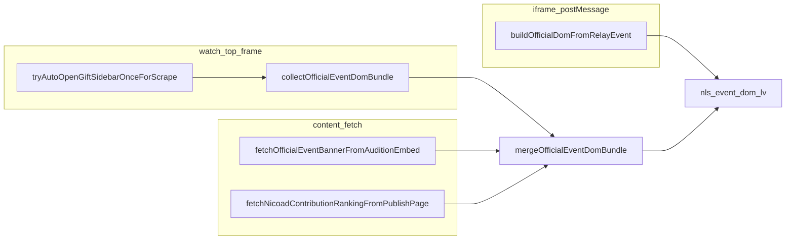

# ギフト／ランキング取得 ディープリサーチ実施記録（2026-05-15）

本書は計画「Gift ranking deep research」の実施結果である。**実装変更は含まない**（コード参照と手順・結論・バックログのみ）。計画ファイル本体は編集しない。

---

## フェーズ A — 再現行列と診断取得手順（固定）

### A.1 独立変数（行列の列）

| 変数 | 取りうる値 | コード上の根拠 |
|------|------------|----------------|
| ギフトランキング opt-in | ON / OFF | [`src/lib/giftRankingLaneOptIn.js`](../../src/lib/giftRankingLaneOptIn.js) … `chrome.storage.local[`nls_gift_ranking_lane_enabled`]` が **`=== true` のときのみ ON**（未設定は OFF） |
| ウィンドウ幅 | 狭い / フル HD 以上 | サイドバー・タブの折り畳み・Vue 遅延に影響（実機で記録） |
| ギフトパネル操作 | 未操作 / 手動でギフトタブを開いた | 自動オープンに依存しない DOM の有無 |
| イベント参加 | あり / なし | `eventBanner` / balloon / NDGR event 系の有無 |
| ログイン | ログイン済 / 未ログイン | `fetchNicoadContributionRankingFromPublishPage` 等 `credentials: 'include'` の成否 |

### A.2 成功判定（先に固定）

| 目的 | 成功の定義（診断 JSON） |
|------|-------------------------|
| 番組貢献度 DOM | `eventDomBundleSummary.contributionRanking` が非 null かつ `length > 0`、または北極星 `1_貢献度ランキング.state === 'ok'` |
| 広告貢献度 | `eventDomBundleSummary.adContributionRanking.count > 0`（**番組貢献度とは別指標**） |
| NDGR ギフト wire | `ndgrWireCounters.gifts > 0`（**配信にギフトが無いと 0 も正常**） |

### A.3 診断 JSON 取得手順（SOP）

1. `chrome://extensions` で拡張を再読み込み。
2. 対象の watch タブで **F5**。
3. popup から **AI 共有用診断**をエクスポート（手順は製品 UI に従う）。
4. 同一 `lv`・**同一時刻付近**で、変数（A.1）を 1 つだけ変えた条件でもう 1 本取得し diff を取る。

保存時は **個人を特定しうる raw コメント本文**をリポジトリに含めない（計画どおり）。

---

## フェーズ B — DOM 契約と auto-open のコード照合

### B.1 スクレイパ正本（`scrapeContributionRankingFromDom`）

[`src/lib/officialEventBannerDom.js`](../../src/lib/officialEventBannerDom.js) 258–284 行付近。優先順位は次のとおり。

1. **第一候補（現行 DOM）**: `.content-supporter-section ul.wrapper > li.item`
2. **第二候補（旧 DOM）**: `.contribution-ranking-list .ranker`
3. **第三候補（CSS Modules 保険）**: `[class*="content-supporter"] ul > li[class*="item"]:not([class*="items"])`

### B.2 auto-open の「ランキング出現」判定（ずれの発見）

[`src/extension/content-entry.js`](../../src/extension/content-entry.js) 10417–10423 行: ポーリングは **常に**

```js
document.querySelector('.contribution-ranking-list .ranker')
```

のみを見ている。

**示唆**: 第一候補の DOM だけが存在し、**`.contribution-ranking-list` が文書に無い**場合、タブクリック後に実際には `li.item` が出ていても **`hasRank` が永続 false** になり、`scrapedRanking` が立たない。一方 `persistOfficialEventDomBundleNow` 内の `scrapeContributionRankingFromDom(document)` は **第一候補で行が取れる**可能性がある（**検出ロジックの不整合**）。

**別系**: `rankTabBtn` が **null** のときはループに入らず、即 `opened-but-no-banner`（10444–10445 行）。診断で `lastStatus === 'opened-but-no-banner'` のときは **「ランキングタブ探索失敗」**を第一疑義にする。

### B.3 実機で記録すべき DOM（手順）

本番 watch でギフトパネルを開き、DevTools で次をコピーする。

- `document.querySelectorAll('.content-supporter-section ul.wrapper > li.item').length`
- `document.querySelectorAll('.contribution-ranking-list .ranker').length`
- ランキングタブ相当要素の `textContent` の先頭 30 文字と `className`（`RANK_TEXT_RE = /ランキング|Ranking|貢献/` に引っかかるか）

---

## フェーズ C — タイミング（3 秒上限）

- **現行**: ランキング用 **6 回 × 500ms = 最大 3 秒**（[`content-entry.js`](../../src/extension/content-entry.js) 10416–10418 行）。
- **実機タスク**: 手動でランキングタブを押してから、上記 B.3 の `li.item` または `.ranker` の件数が正になるまでの秒数を **10 セッション**メモし p50/p90 を取る（狭幅／広幅で分ける）。
- **判断**: p90 が 3s を超えるなら「待ち延長」は **サイドバー開放時間の UX** とトレードオフ → フェーズ D の別経路（fetch / relay）強化や、フェーズ E の別トリガー再試行とセットで検討。

---

## フェーズ D — 取得経路の役割・マージ・誤解リスク

### D.1 データフロー（要約）



### D.2 `mergeOfficialEventDomBundle`（温存ルール）

[`src/lib/officialEventDomBundle.js`](../../src/lib/officialEventDomBundle.js) 193–216 行: **next に値が無い field は prev を温存**（`contributionRanking: next || prev`）。一時的に DOM が閉じたとき古いランキングが残りうる（既存メモ [D2](../research/gift-related-deep-research.md)）。

### D.3 relay の意図的ドロップ

[`src/lib/iframeOfficialDomFromRelay.js`](../../src/lib/iframeOfficialDomFromRelay.js) 先頭コメントおよび [`gift-related-deep-research.md`](gift-related-deep-research.md) §2.3: **nicoad iframe 由来の `contributionRanking` は採用しない**（広告 pt 混入対策）。**nicoad fetch で取った配列は「広告貢献度」用途**。

### D.4 誤解しやすい点

| 表示 | 意味 |
|------|------|
| 広告ランキング 5 件 | **番組貢献度の代理ではない**（nicoad / 広告 DOM） |
| 北極星 `+α_広告ランキング` ok | 広告経路は健全でも、レーン 1 が `iframe_unrendered` のままありうる |

---

## フェーズ E — ポリシー（opt-in / 30 秒リトライ抑制）

### E.1 opt-in の意図

[`giftRankingLaneOptIn.js`](../../src/lib/giftRankingLaneOptIn.js) コメント: 公式 iframe が placeholder のまま等で **「お困りの方はこちら」**を誘発し UX を損ねたため **既定 OFF**、ユーザー明示 ON のときだけ auto-open。

### E.2 30 秒リトライ抑制

[`content-entry.js`](../../src/extension/content-entry.js) 8971–8998 行: 初回 auto-open の `lastStatus` が `opened-but-no-banner` または `opened-no-banner-no-ranking:*` のとき **30 秒後の再試行をスキップ**（同じ rescue 状態の再誘発回避）。

### E.3 改善オプション（実装は別 PR）

| ID | 内容 | リスク / 効果 |
|----|------|----------------|
| E3a | **診断強化**: `opened-but-no-banner` を「rankTab 未検出」と「3s 以内 ranker 未検出」に分解して `rankingDiag` に出す | 低リスク、現場切り分け容易 |
| E3b | **別トリガー再試行**: ユーザーがギフトボタンを手動で開いた後の一度だけ `persistOfficialEventDomBundleNow` | rescue 連打を避けつぎ取り可能 |
| E3c | **B.2 の検出整合**: `hasRank` を `scrapeContributionRankingFromDom` と同義の DOM シグナルに揃える | タブは取れているのに ranking だけ失敗、を減らす可能性 |
| E3d | 待ち時間延長 | サイドバー開放時間増・ユーザー体感とのトレードオフ |

---

## フェーズ F — NDGR `gifts === 0` の切り分け

### F.1 カウンタの意味

[`page-intercept-entry.js`](../../src/extension/page-intercept-entry.js) 564–603 行: `decodeChunkedMessage` の `result.gifts` を列挙し、**各要素で `_ndgr.gifts++`**（uid 無しでもカウント v0.1.204）。`data-nls-ndgr` の `g=` が診断の `ndgrWireCounters.gifts`。

### F.2 分岐表

| 状況 | 解釈 | 次のアクション |
|------|------|----------------|
| 画面上にギフトが流れているのに `gifts === 0` | decode / msg 型 / 取りこぼし疑い | `ndgrUnknownSamples`・`ndgrTagHistogram`・`decoded` と比較し [`ndgrDecode.js`](../../src/lib/ndgrDecode.js) 側を調査 |
| 画面上もギフト無し | 観測ゼロ | レーン 1/2 と切り離し、「取り逃し」と表現しない |
| `gifts > 0` だが `giftsWithUid` 等が極端に低い | field 認識ズレ | page-intercept コメント v0.1.221 どおり内訳で段特定 |
| `gifts > 0` だが popup 送信者 0 | 受信側ゲート | `mergeGiftUsers` / persist ゲート調査（既存 N1 系） |

---

## 結論表（症状 × 原因候補 × 検証 × アクション）

| 症状（診断） | 第一候補 | 検証 | 推奨アクション |
|--------------|----------|------|----------------|
| `autoOpen.lastStatus === 'opened-but-no-banner'` | **ランキングタブ未検出**（`rankTabBtn` null） | 同一セッションで `lastSidebarHints` とギフトパネル DOM を目視 | タブ文言・クラス変更の調査；E3a でログ分解 |
| `opened-no-banner-no-ranking:*` | タブは押せたが **3s 以内に旧セレクタで ranker 未検出** | B.3 の両セレクタ件数をクリック直後に記録 | **E3c**（検出整合）＋フェーズ C の p90 測定 |
| `contributionRanking` null だが nicoad 5 件 | **正常差分**（広告のみ取れている） | `adContributionRanking` とレーン `+α` の一致 | ユーザー説明／北極星コピー調整は別判断 |
| 北極星 1/2 `iframe_unrendered` | bundle 欠＋ギフト pt あり等（[`northStarLaneReason.js`](../../src/lib/northStarLaneReason.js)） | `eventDomBundleSummary` と `officialValuesV2.giftPoints` | 手動でギフトタブを開けて再診断；opt-in ON 確認 |
| `auditionFetchStatus: empty` | HTML 空・未ログイン・URL/version 不一致（F1） | Network で audition embed の status / 長さ | [`fetchOfficialEventBannerFromAuditionEmbed`](../../src/lib/officialEventDomBundle.js) の前提確認 |
| `ndgrWireCounters.gifts: 0` | 配信にギフト無し **または** decode 経路 | 画面と `g` / `ndgrUnknownSamples` | フェーズ F 表に従う |

---

## P0–P3 バックログ

| 優先度 | タスク | 状態 |
|--------|--------|------|
| **P0** | auto-open の `hasRank` を `scrapeContributionRankingFromDom` と整合 | **実装済**（`hasContributionRankingDomSignal`／[`officialEventBannerDom.js`](../../src/lib/officialEventBannerDom.js)・[`content-entry.js`](../../src/extension/content-entry.js)） |
| **P0** | 失敗理由の細分化（ランキングタブ未検出 vs DOM タイムアウト） | **実装済**（`autoOpenLastDetailCode` + [`deriveAutoOpenFailureReason`](../../src/lib/diagWarnings.js) の `rank_tab_not_found` / `ranking_dom_timeout`・診断 JSON `rankingDiag.autoOpen.lastDetailCode`） |
| **P1** | 手動計測のうえ 3s ポーリングの妥当化 | 未着手（フェーズ C） |
| **P2** | 手動ギフトオープン後の単発 `persist`（E3b）設計 | 未着手 |
| **P3** | 広告 vs 番組貢献度のユーザー向け短文 | 未着手 |

---

## 完了チェック（計画 To-do 対応）

| 計画 ID | 本書セクション |
|---------|----------------|
| matrix-repro | §A |
| dom-contract | §B |
| timing-vue | §C |
| merge-fallback | §D |
| policy-retry | §E |
| ndgr-gifts | §F |
| deliverable | 結論表・P0–P3・本ファイル全体 |
