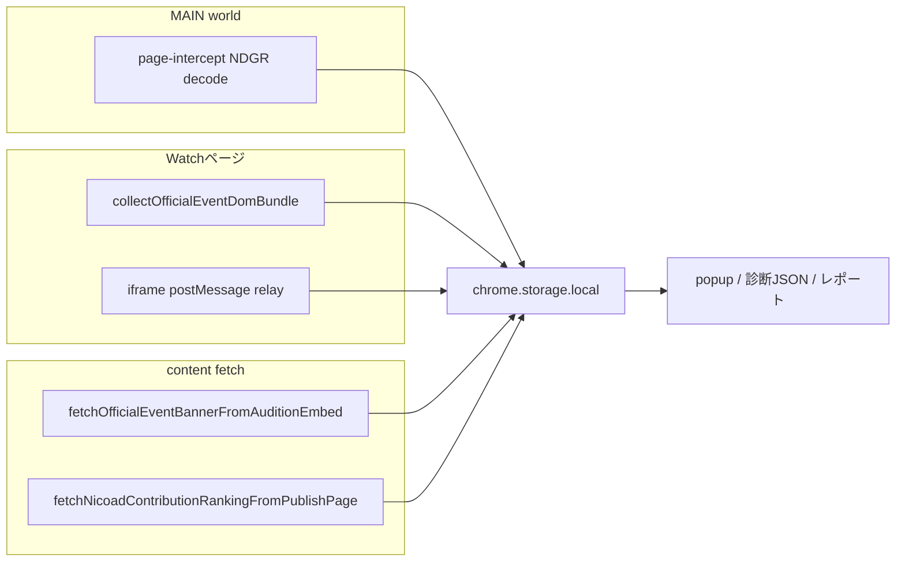

# ギフト関連ディープリサーチ（調査メモ・実装なし）

本書は「ギフト・広告ランキング・貢献度ランキング・イベント」周辺が **どの経路で入り、いつ欠けるか** を整理する調査用メモです。コード変更や新規 API は対象外です。

---

## 1. 取得経路マップ（正本の起点）

| 情報カテゴリ | 主な根拠ファイル |
|-------------|------------------|
| ギフト（ストリーム / NDGR 集計） | [`src/extension/page-intercept-entry.js`](../../src/extension/page-intercept-entry.js)、[`src/lib/ndgrDecode.js`](../../src/lib/ndgrDecode.js) |
| ギフトユーザー行（マージ後） | `NLS_INTERCEPT_GIFT_USERS` → [`src/lib/giftRecord.js`](../../src/lib/giftRecord.js) `mergeGiftUsers` → `nls_gift_users_<lv>` |
| ギフト履歴（sub-app DOM） | [`src/lib/officialEventDomBundle.js`](../../src/lib/officialEventDomBundle.js) の `giftHistory`、`nls_gift_subapp_history_<lv>`（[`storageKeys.js`](../../src/lib/storageKeys.js)） |
| 貢献度ランキング vs 広告 | watch DOM の `scrapeContributionRankingFromDom`、広告 fetch [`fetchNicoadContributionRankingFromPublishPage`](../../src/lib/officialEventDomBundle.js)、relay 分類 [`src/lib/giftSubAppFrameSource.js`](../../src/lib/giftSubAppFrameSource.js) |
| イベントバナー等 | bundle + `fetchOfficialEventBannerFromAuditionEmbed` → `nls_event_dom_<lv>` にマージ保存（[`src/extension/content-entry.js`](../../src/extension/content-entry.js) 周辺） |

---

## 2. フェーズ1: 経路 × ストレージキー × メッセージ型（棚卸し）

### 2.1 主要 `chrome.storage.local` キー

| キー（パターン） | 書き込み主経路 | 主な読み手（後述「既存ツール」） |
|------------------|----------------|-----------------------------------|
| `nls_gift_users_<lv>` | MAIN → `postMessage` → `NLS_INTERCEPT_GIFT_USERS` → content が `mergeGiftUsers` 後 `set` | popup 帯、AI 共有診断、`giftDiagnosticsForAiShare` |
| `nls_gift_subapp_history_<lv>` | content が iframe スキャン結果を `set`（`giftSubAppHistoryStorageKey`） | popup「ギフト sub-app 履歴」ブロック |
| `nls_gift_events_<lv>` | content（時系列・コメント付近の処理） | 診断・デバッグ用途 |
| `nls_gift_history_throws_<lv>` | `mergeGiftHistoryThrows` 系 | popup ギフト履歴診断 |
| `nls_event_dom_<lv>` | content の定期 bundle + fetch 結果のマージ（`eventDomStorageKey`） | 北極星・貢献度帯、HTML レポート、マーケ文脈 |
| `nls_iframe_official_dom_<lv>` | `NLS_GIFT_HISTORY_FROM_IFRAME` 受信 → [`buildOfficialDomFromRelayEvent`](../../src/lib/iframeOfficialDomFromRelay.js) が **採用した** ranking/banner のみ | popup が `get` して watch snapshot と合成 |
| `nls_gift_ranking_lane_enabled` | popup トグル → content が取得ループを開始 | ギフトランキングレーン opt-in（[`giftRankingLaneOptIn.js`](../../src/lib/giftRankingLaneOptIn.js)） |

### 2.2 `postMessage` / intercept 型（ギフト関連）

| 型 | 送信元 | 受信 | 備考 |
|----|--------|------|------|
| `NLS_INTERCEPT_GIFT_USERS` | page-intercept (MAIN) | content（要 `data-nls-page-token` 認証） | NDGR 由来ギフトユーザーをマージ |
| `NLS_INTERCEPT_CHAT_ROWS` 等 | 同上 | 同上 | コメント経路（ギフト本文パターンは別処理あり） |
| `NLS_GIFT_SUBAPP_RELAY_HEARTBEAT` | nicovideo 子 iframe | content | 観測のみ（[`giftSubAppRelayTrust.js`](../../src/lib/giftSubAppRelayTrust.js) で型・origin・`frameUrl` 一致必須） |
| `NLS_GIFT_HISTORY_FROM_IFRAME` | 同上 | content | 履歴 DOM スキャン結果。信頼 host / `frameUrl`≡`e.origin` |

**拒否時に欠けるもの**（[`isTrustedGiftSubAppRelayMessage`](../../src/lib/giftSubAppRelayTrust.js) が false）:

- 該当 `postMessage` は処理されない → **heartbeat も履歴も増えない** → `giftSubAppRelayDiag` で「未受信／cross-origin throw」系に表れる。
- `frameUrl` 空・origin 不一致・非許可 host → 意図的に偽装防止のためドロップ。

### 2.3 relay 採用ルール（貢献度 vs 広告の意図的ドロップ）

[`buildOfficialDomFromRelayEvent`](../../src/lib/iframeOfficialDomFromRelay.js): `nicoad` 由来の `contributionRanking` は **捨てる**（広告 pt 混入対策）。`audition` / `koken` のみ貢献度として採用。イベントバナーは **audition のみ**。

---

## 3. フェーズ2: 欠落・混入モード（仮説カタログ）

| ID | モード | 根拠・見る場所 |
|----|--------|----------------|
| N1 | NDGR 上では gift イベントがあるが `nls_gift_users` が空 | [`giftDiagnosticsForAiShare.js`](../../src/lib/giftDiagnosticsForAiShare.js) ヒント、`data-nls-ndgr` の `g` vs storage、`popupAiShareDiagnosticsPayload` の gift 件数 |
| N2 | protobuf / msg 経路変化（field 取りこぼし） | `data-nls-ndgr-unknown-samples`、`giftsUid`/`giftsItem` 等の内訳（page-intercept） |
| D1 | ギフトサイドバー未表示で bundle が空 | `collectOfficialEventDomBundle` が全部 null → 保存 skip 近傍 |
| D2 | マージで **古い** ranking / stats が残る | [`mergeOfficialEventDomBundle`](../../src/lib/officialEventDomBundle.js)（next 優先だが片方 null だと prev 温存） |
| R1 | iframe relay は動くが貢献度が空 | `buildOfficialDomFromRelayEvent` の `reason: 'all-dropped'`（nicoad のみ等） |
| R2 | koken は信頼だが Vue 未描画で 0 件 | heartbeat はあるが history 空、診断 `giftSubAppDiag` |
| F1 | audition / nicoad fetch が失敗 | `credentials: 'include'`、404、空 HTML、URL 固定 `frontend_version`（[`officialEventDomBundle.js`](../../src/lib/officialEventDomBundle.js)） |
| A1 | 未ログイン・別 lv のタブ優先 | multi-tab 診断、`extractLiveIdFromUrl` 不一致 |

優先度は実機で後付け。

---

## 4. フェーズ3: 実配信プロトコル（観測手順）

| シナリオ | 最低観測時間の目安 | 確認すること |
|----------|-------------------|--------------|
| イベント参加 + ギフト多め | 開始後 15〜30 分 | `nls_event_dom` の balloon/banner、NDGR `g`、storage ギフト行の相関 |
| ニコニ広告ランキングあり | 同上 | nicoad fetch 成否、`adContributionRanking` vs watch 上の貢献度 DOM |
| サイドバー未操作 | 10 分 | relay heartbeat / `nls_gift_subapp_history` が動くか |
| iframe 遅延・ブロック疑い | 1 セッション | `content.giftDiagnostics.giftSubAppRelayDiag` |

**記録**: 診断 JSON の該当ブロックのみ。個人を特定する raw コメント・本名はレポジトリに載せない。

---

## 5. フェーズ4: 外部ページ DOM 定点（手順のみ）

1. 同一 `lv` で `https://audition.nicovideo.jp/embedded/richview/live?content_id=<lv>&frontend_id=9&frontend_version=644.0.0` を開く。
2. `https://nicoad.nicovideo.jp/live/publish/<lv>?frontend_id=9` を開く。
3. DevTools で [`officialEventBannerDom.js`](../../src/lib/officialEventBannerDom.js) のセレクタ（例: `.content-supporter-section ul.wrapper > li.item`、フォールバック `[class*="content-supporter"]`）がヒットするか確認。
4. 差分はローカル調査メモにスクショ＋セレクタ一覧（本リポジトリへの無断コミットはしない）。

（自動 fetch はログイン・CORS のため CI からは保証できない。）

---

## 6. 既存ツールが「どう参照しているか」（本リクエスト追補）

ここでの「既存ツール」は **本リポジトリに既にある観測・UI・純関数** に限る。外部のニコ生公式ツールではない。

### 6.1 データの「生産」と「消費」の関係

| ツール / 機能 | 実装の入り口 | 主な入力データ（どこから来るか） |
|---------------|--------------|----------------------------------|
| **content の `buildGiftDiagnosticsBundle()`** | [`content-entry.js`](../../src/extension/content-entry.js) 内で組立 | 実行中メモリ（relay 診断 state、DOM probe、NDGR 属性 `data-nls-ndgr*`、nicoad fetch 結果のキャッシュ等）。**ストレージ全文ではない**ことが多い。 |
| **AI 共有・最大診断 JSON** | [`buildPopupAiShareDiagnosticsPayload`](../../src/lib/popupAiShareDiagnosticsPayload.js) | `chrome.storage.local.get`（`giftUsersStorageKey`、`KEY_*` 多数）、**別途 tabs から取った `deps.contentDiagnostics`**（= watch タブの content が返すスナップショットに `giftDiagnostics` を含む）。 |
| **ギフトパイプライン用ヒント（静的文）** | [`GIFT_PIPELINE_AI_HINTS_JA`](../../src/lib/giftDiagnosticsForAiShare.js) | コード内固定文字。調査の「疑う順序」の正本。 |
| **`parseDataNlsNdgrAttr` / `summarizeGiftStorageForDiagnostics`** | 同上 | DOM 属性文字列、`nls_gift_users_*` の **形状と件数のみ**（PII 最小化）。 |
| **開発監視「ギフトランキング」行** | [`summarizeDevMonitorGiftRanking`](../../src/lib/summarizeDevMonitorGiftRanking.js) | **popup がキャッシュした fast 診断**の `content.giftDiagnostics`（content からメッセージで届いたもののコピー）。storage を直接読まない。 |
| **MCP 正準スナップショット L1** | [`buildLiveMcpSnapshot`](../../src/lib/mcpBridge/buildLiveMcpSnapshot.js) | 呼び出し元が渡す `officialValuesV2`（フィールドごとに `{ value, source, ageMs, reason }`）。**マージ規約はコード固定**: 例として `programGiftPoints` / `giftPoints` は **`['ndgr','domStats']` 優先**、`eventGiftScore` / `nicoEventRank` / `nicoEventTitle` は **`['ndgr','domBanner']` 優先**（コメント [`buildLiveMcpSnapshot.js` L118-L127](../../src/lib/mcpBridge/buildLiveMcpSnapshot.js)）。 |
| **AI 共有 Markdown 整形** | [`formatAiShareDiagnosticsMarkdown.js`](../../src/lib/formatAiShareDiagnosticsMarkdown.js) | 上記診断 JSON を人間向けに要約。 |
| **popup 北極星・貢献度帯** | [`popup-entry.js`](../../src/extension/popup-entry.js) | `eventDomStorageKey(lid)` で **`nls_event_dom_*` を直接 `get`**。watch snapshot と合成する箇所あり。 |
| **HTML レポート / マーケ** | popup 側ヘルパ（`loadEventDomBundleOnce` 等のコメント参照） | 同じく `nls_event_dom_*` を中心に読む設計（[`officialEventDomBundle.js`](../../src/lib/officialEventDomBundle.js) 冒頭コメント）。 |

### 6.2 調査時の読み分け（ツール視点）

1. **「NDGR は生きているか」** → watch ページの `document.documentElement` の `data-nls-ndgr`（`parseDataNlsNdgrAttr` と同等の目視）または診断 JSON の `ndgrWireCounters` / tag ヒストグラム。
2. **「ストレージに行が着いたか」** → `summarizeGiftStorageForDiagnostics` が出す shape / rowCount（AI 共有 JSON に含まれる）または `chrome.storage.local` の該当キー（開発者のみ）。
3. **「DOM / iframe 経路は生きているか」** → `giftSubAppRelayDiag`（受信件数・heartbeat・cross-origin throw）、`giftSubAppDiag`（history 件数・frame 数）。
4. **「正規化された公式値のどれを採ったか」** → MCP 用に export する場合は `buildLiveMcpSnapshot` の出力 `gift.*.source`（`ndgr` / `domStats` / `domBanner`）。

### 6.3 既存ツールにないもの（調査で補う）

- ニコ側の A/B DOM の **実ページ差分**（フェーズ4の手動確認）。
- 配信種別ごとの **真の正本**（公式がどちらを権威とみなすか）はコード外。ここでは「拡張が採用している優先順位」のみ記述済み。

---

## 7. フェーズ5: 結論テンプレ（1 情報ごとに埋める）

| 項目 | 記入欄 |
|------|--------|
| 情報名 | （例: 広告ランキング mirror HTML） |
| 正本経路 | （単一か / 複合か） |
| 補完経路 | |
| 既知 false positive | |
| 現場 3 手順 | ①… ②… ③… |

運用提案（「診断のどのキーを見る」等）は **実装せず** 上表にメモするのみ。

---

## 8. やらないこと（再掲）

- `host_permissions` の拡張、未承認ドメインへの実装追加。
- `ndgrDecode` / scrape の無計画変更。
- 匿名化なし個人データのコミット。

---

## 参照読み順（短縮）

1. [`src/lib/giftSubAppFrameSource.js`](../../src/lib/giftSubAppFrameSource.js)
2. [`src/lib/officialEventDomBundle.js`](../../src/lib/officialEventDomBundle.js)
3. [`src/lib/giftDiagnosticsForAiShare.js`](../../src/lib/giftDiagnosticsForAiShare.js) + [`popupAiShareDiagnosticsPayload.js`](../../src/lib/popupAiShareDiagnosticsPayload.js)
4. [`src/lib/mcpBridge/buildLiveMcpSnapshot.js`](../../src/lib/mcpBridge/buildLiveMcpSnapshot.js)
5. [`src/extension/content-entry.js`](../../src/extension/content-entry.js)（`buildGiftDiagnosticsBundle` / `NLS_*` handler / `eventDomStorageKey` 保存）
6. [`src/lib/officialEventBannerDom.js`](../../src/lib/officialEventBannerDom.js)
